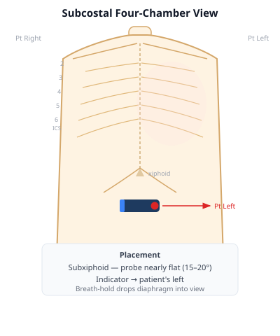
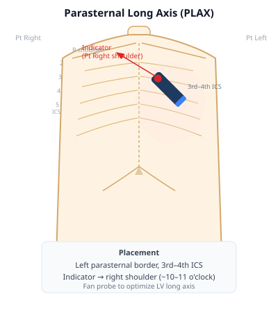
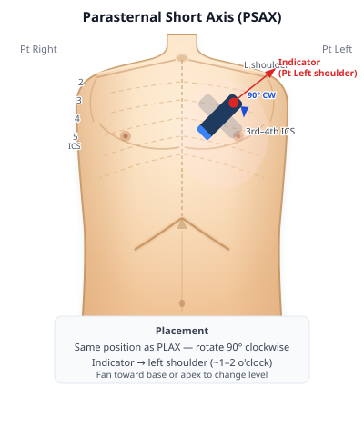
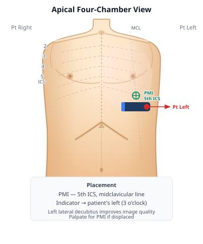

## Overview

Bedside cardiac ultrasound begins with four standard windows. Each window shows the heart from a different acoustic angle, and each reveals structures that the others cannot. No single window is sufficient for a complete exam — the goal is to build a three-dimensional mental model of the heart by integrating what you see across all four views.

This module covers:

- Machine setup and probe selection
- How to obtain each window reliably
- The normal anatomy visible in each view
- Common normal variants

Pathology is introduced in later modules. The goal here is to recognize a normal study confidently before encountering abnormalities.

---

## 1. Machine setup

**Probe:** Phased array (cardiac) probe. The small footprint fits between ribs; the sector beam provides the wide near-field needed to visualize the full heart. A curvilinear probe is an acceptable substitute when a phased array is unavailable. A linear probe is not appropriate for cardiac imaging.

**Preset:** Select the **cardiac preset**. This does two important things:

1. Inverts the depth convention so the apex appears at the top of the screen in apical views (cardiac orientation).
2. Optimizes gain, frequency, and frame rate for cardiac imaging.

**Depth:** Adjust so the far wall of the structure of interest is visible with a small margin beyond it. Too little depth clips posterior structures; too much depth makes cardiac structures appear small and reduces resolution.

**Gain:** Adjust so that blood appears dark (anechoic) and myocardium appears mid-gray. An overgained image obscures the distinction between fluid and tissue.

**Indicator convention:** In cardiac imaging, the probe indicator is displayed on the **right side of the screen**. Confirm this on your machine before starting — some machines default to the left (radiology convention). If the indicator is on the wrong side, the image will be mirrored.

---

## 2. The four standard windows

---

### Subcostal four-chamber view

::: {.callout-tip}
**Video slot:** Subcostal four-chamber acquisition — probe position, indicator orientation, fanning technique, optimization tips.
:::

{fig-align="center" width="380"}

**Probe placement:** Subxiphoid, probe nearly flat against the abdomen (15–20° angle above horizontal). Indicator points to the patient's **left**. Use the left lobe of the liver as an acoustic window.

**How to optimize:**

- Ask the patient to inhale slowly and hold — this drops the diaphragm and brings the heart into the imaging plane.
- Apply firm, steady pressure. Sustained pressure displaces bowel gas and improves the window.
- If the view is poor, move the probe slightly to the right (more liver), or ask the patient to bend their knees to relax the abdominal wall.
- In intubated or supine patients, this is often the most accessible window and does not require repositioning.

**Normal anatomy visible:**

| Structure | Location in image |
|---|---|
| Liver | Near-field, top left — acoustic window |
| Right ventricle | Nearest the probe, top of the cardiac image |
| Interventricular septum | Separates RV from LV |
| Left ventricle | Deep to the septum |
| Right atrium | Upper right |
| Left atrium | Deepest chamber |
| Tricuspid valve | Between RA and RV |
| Mitral valve | Between LA and LV |
| Pericardium | Bright echogenic line surrounding the heart |

**Why this window first:** In undifferentiated shock or cardiac arrest, the subcostal view is the fastest to obtain and does not require repositioning the patient. It is the window most likely to be achievable in a supine, ventilated patient.

---

### Parasternal long axis

::: {.callout-tip}
**Video slot:** Parasternal long axis acquisition — rib interspace selection, indicator toward the right shoulder, tilting to optimize the LV long axis.
:::

{fig-align="center" width="380"}

**Probe placement:** Left parasternal border, **3rd or 4th intercostal space**, indicator pointing toward the patient's **right shoulder** (approximately 10–11 o'clock). The imaging plane cuts through the long axis of the left ventricle.

**How to optimize:**

- Move up or down one rib space if the LV appears foreshortened or the apex is cut off.
- Tilt the probe slightly medially or laterally to bring the aortic root and LV into the same plane.
- The aortic valve should appear central and open symmetrically in systole.
- The LV walls should appear equal in thickness and the chamber should not appear foreshortened.

**Normal anatomy visible:**

| Structure | Location in image |
|---|---|
| Right ventricle | Near-field, anterior (top of image) |
| Interventricular septum | Separates RV from LV |
| Left ventricle | Central, posterior to septum |
| Anterior mitral leaflet | Long, swings widely open in diastole |
| Posterior mitral leaflet | Short, moves in opposite direction |
| Left atrium | Posterior, deep |
| Aortic valve | Right side of image — three thin leaflets |
| Aortic root / LVOT | Connects LV to aortic valve |
| Descending thoracic aorta | Far left — round cross-section |

**Key landmark:** The descending thoracic aorta appears in cross-section at the far left of the PLAX image. This is an important orientation landmark used in pathology assessment (covered in Module 4).

---

### Parasternal short axis

::: {.callout-tip}
**Video slots:**
- PSAX at the aortic valve level — the Mercedes-Benz sign, RVOT, pulmonary valve
- PSAX at the mitral valve level — the fish mouth opening
- PSAX at the papillary muscle level — the donut view, concentric LV contraction
:::

{fig-align="center" width="380"}

**Probe placement:** Same position as PLAX, then **rotate the probe 90° clockwise** — indicator moves toward the patient's **left shoulder** (approximately 1–2 o'clock). The imaging plane now cuts the heart in cross-section.

**Fanning between levels:** Tilt the probe toward the right shoulder (base) to image higher cross-sections; tilt toward the left hip (apex) to image lower cross-sections.

**How to optimize:**

- At the papillary muscle level, the LV should appear **round**, not oval. An oval appearance means the plane is slightly oblique — adjust.
- At the aortic valve level, all three cusps should be visible on closure.

**Normal anatomy by level:**

*Aortic valve level (most basal):*

| Structure | Location |
|---|---|
| Aortic valve | Center — three cusps forming a Y on closure ("Mercedes-Benz sign") |
| Right ventricular outflow tract | Anterior, wrapping around the aorta |
| Pulmonary valve | Anterior left |
| Tricuspid valve | Right |
| Right atrium | Right |
| Left atrium | Posterior |

*Mitral valve level:*

| Structure | Location |
|---|---|
| Left ventricle | Central — mitral valve visible as a "fish mouth" opening in diastole |
| Right ventricle | Anterior, crescent-shaped |
| Anterior mitral leaflet | Anterior (longer leaflet) |
| Posterior mitral leaflet | Posterior (shorter leaflet) |

*Papillary muscle level (mid-ventricular):*

| Structure | Location |
|---|---|
| Left ventricle | Round, central — the "donut" view |
| Right ventricle | Crescent-shaped, anterior |
| Interventricular septum | Separates RV and LV |
| Anterolateral papillary muscle | Lateral LV wall |
| Posteromedial papillary muscle | Inferior LV wall |

**Why this window matters:** PSAX at the papillary muscle level is the best single view for a quick visual estimate of LV systolic function and for identifying septal flattening from RV pressure or volume overload — both covered in later modules.

---

### Apical four-chamber

::: {.callout-tip}
**Video slot:** Apical four-chamber acquisition — finding the PMI, lateral decubitus positioning, depth adjustment to bring the apex to the top.
:::

{fig-align="center" width="380"}

**Probe placement:** Point of maximal impulse (PMI), typically **5th intercostal space, midclavicular line**. Indicator points to the patient's **left** (3 o'clock). The imaging plane cuts the heart from apex to base, showing all four chambers simultaneously.

**How to optimize:**

- Left lateral decubitus positioning brings the heart toward the chest wall and significantly improves image quality — use it whenever possible.
- In the cardiac preset, the apex should appear at the **top** of the screen. Reduce depth so the apex sits at the top with a small margin.
- In obese patients or those with COPD, the PMI may be displaced — palpate rather than assuming position.
- If the view is suboptimal, try moving one interspace lateral or inferior.

**Normal anatomy visible:**

| Structure | Location in image |
|---|---|
| LV apex | Top center |
| Left ventricle | Left side of image |
| Right ventricle | Right side of image (smaller than LV) |
| Mitral valve | Left AV valve — opens widely in diastole |
| Tricuspid valve | Right AV valve — inserts slightly more apically than mitral |
| Left atrium | Bottom left |
| Right atrium | Bottom right |
| Interventricular septum | Vertical, separates LV and RV |
| Interatrial septum | Thin membrane between LA and RA |

**Key observation:** The tricuspid valve inserts slightly more apically on the interventricular septum than the mitral valve. This normal apical offset reliably identifies which AV valve is which when orientation is uncertain.

---

## 3. Normal anatomy and normal variants

Fellows need to review many normal studies before pathology becomes recognizable. The following describes what a normal heart looks like across the four windows and identifies common normal variants that may be mistaken for pathology.

::: {.callout-tip}
**Video slots:** Normal studies across body habitus — thin patient, obese patient, COPD, post-CABG. Aim to review at least 10 normal loops per window before moving to pathology modules.
:::

### Normal LV size and wall motion

- LV internal diameter (diastole): 3.8–5.5 cm on PLAX
- Interventricular septum thickness: 0.6–1.1 cm
- Posterior wall thickness: 0.6–1.1 cm
- Wall motion: symmetric, brisk inward thickening of all walls in systole

### Normal RV size

On apical four-chamber, the RV should occupy approximately the right one-third of the image and appear clearly smaller than the LV. A rough rule: the RV should be no larger than two-thirds the size of the LV. The RV free wall is thin and contracts vigorously.

### Normal valve motion

- **Aortic valve:** Three thin leaflets opening fully to the aortic walls in systole; central coaptation in diastole. On PSAX: Y-shaped (Mercedes-Benz) closure.
- **Mitral valve:** Anterior leaflet swings widely open in diastole. Posterior leaflet moves in the opposite direction and is shorter. Both coapt in systole with no gap.
- **Tricuspid valve:** Three thin leaflets visible in subcostal and apical views. Normal trace tricuspid regurgitation on color Doppler is a common normal variant.

### Normal pericardium

A thin, bright (hyperechoic) line surrounding the heart, visible in all windows. It moves with the heart. No echo-free space is present between the layers in a normal study.

### Normal variants

**Moderator band:** A muscular structure crossing the RV cavity from the interventricular septum to the anterior free wall, most visible on apical four-chamber. Normal structure — should not be mistaken for a mass or thrombus.

**False tendons:** Thin, linear echogenic structures traversing the LV cavity, usually wall to wall. Normal variant — can be mistaken for vegetations or thrombus. They are fixed, linear, and do not move independently.

**Prominent apical trabeculations:** Muscular ridges along the inner LV wall, most prominent at the apex. Normal. If extensive and affecting multiple segments, refer for formal echo to evaluate for non-compaction cardiomyopathy.

**Chiari network:** A mobile, fenestrated structure in the right atrium near the inferior vena cava — a remnant of the embryologic valve of the sinus venosus. Normal; may be mistaken for a thrombus or vegetation.

**Pericardial fat pad:** An echogenic (bright, not anechoic) structure anterior to the RV. Common in older and obese patients. Does not shift with repositioning. Differentiated from pathologic fluid by echogenicity — fat is bright, fluid is black. Covered further in Module 4.

---

## Quiz

Anki deck for spaced repetition: *link coming soon.*

::: {.callout-note}
**Q1.** You place the probe at the left parasternal border with the indicator pointing toward the right shoulder. Which window are you in? Name four structures you expect to see.

::: {.callout-caution collapse="true"}
**Answer**
Parasternal long axis (PLAX). Expected structures include: right ventricle (near-field), interventricular septum, left ventricle, anterior and posterior mitral valve leaflets, left atrium, aortic valve, aortic root/LVOT, and the descending thoracic aorta in cross-section at the far left.
:::

**Q2.** You are in PLAX and want to move to PSAX. What do you do with the probe?

::: {.callout-caution collapse="true"}
**Answer**
Rotate the probe 90° clockwise from the PLAX position. The indicator moves from pointing toward the right shoulder to pointing toward the left shoulder (approximately 1–2 o'clock). The imaging plane now cuts the heart in cross-section.
:::

**Q3.** In the subcostal four-chamber view, which cardiac chamber is closest to the probe? What structure serves as the acoustic window?

::: {.callout-caution collapse="true"}
**Answer**
The right ventricle is closest to the probe. The left lobe of the liver serves as the acoustic window.
:::

**Q4.** On PSAX at the aortic valve level, you see three cusps forming a Y-shape on closure. What is this called, and what does it confirm?

::: {.callout-caution collapse="true"}
**Answer**
The Mercedes-Benz sign. It confirms a normal tricuspid aortic valve with three cusps — right coronary, left coronary, and non-coronary. If only two cusps are visible with an oval "fish mouth" opening, consider a bicuspid aortic valve.
:::

**Q5.** In the apical four-chamber view, how do you distinguish the mitral valve from the tricuspid valve?

::: {.callout-caution collapse="true"}
**Answer**
The tricuspid valve inserts slightly more apically on the interventricular septum than the mitral valve — this apical offset is the key distinguishing feature. The tricuspid is on the right side of the image (associated with the RV and RA); the mitral is on the left (associated with the LV and LA).
:::

**Q6.** What is the correct indicator orientation for each of the four standard windows?

::: {.callout-caution collapse="true"}
**Answer**
- **Subcostal four-chamber:** Indicator to the patient's left
- **Parasternal long axis:** Indicator toward the patient's right shoulder (~10–11 o'clock)
- **Parasternal short axis:** Indicator toward the patient's left shoulder (~1–2 o'clock)
- **Apical four-chamber:** Indicator to the patient's left (3 o'clock)
:::

**Q7.** At the papillary muscle level on PSAX, you see two echogenic nodular structures on the LV wall. What are they, and where are they located?

::: {.callout-caution collapse="true"}
**Answer**
The anterolateral and posteromedial papillary muscles. The anterolateral papillary muscle is on the lateral wall; the posteromedial papillary muscle is on the inferior wall. They are the attachment points for the chordae tendineae that tether the mitral valve leaflets.
:::

**Q8.** You see a thin, linear echogenic structure crossing the LV cavity from wall to wall on apical four-chamber. It does not move independently. What is it, and is it pathologic?

::: {.callout-caution collapse="true"}
**Answer**
A false tendon (aberrant chordae tendineae). This is a normal variant — a fixed, linear structure without hemodynamic significance. It should not be mistaken for a vegetation (which is irregular and attached to a valve leaflet) or intracardiac thrombus (which is typically at the apex and has a different morphology).
:::
:::
