## Overview

Bedside cardiac ultrasound begins with four standard windows. Each window shows the heart from a different acoustic angle, and each reveals structures that the others cannot. No single window is sufficient for a complete exam — the goal is to build a three-dimensional mental model of the heart by integrating what you see across all four views.

This module covers:

- Machine setup and probe selection
- How to obtain each window reliably
- The normal anatomy visible in each view

Pathology is introduced in later modules. The goal here is to recognize a normal study confidently before encountering abnormalities.

---

## 1. Machine setup

**Probe:** Phased array (cardiac) probe. Its small footprint fits between ribs; the sector widens with depth to include deeper cardiac structures.

**Preset:** Select the **cardiac preset**. This does two important things:

1. Uses cardiac imaging settings and usually places the display indicator on screen right; confirm the actual indicator position on your machine. This is a horizontal display convention, not a reversal of depth.
2. Optimizes gain, frequency, and frame rate for cardiac imaging.

**Depth:** Adjust so the far wall of the structure of interest is visible with a small margin beyond it. Too little depth clips posterior structures; too much depth makes cardiac structures appear small and reduces resolution.

**Gain:** Adjust so that blood appears dark (anechoic) and myocardium appears mid-gray. An overgained image obscures the distinction between fluid and tissue.

**Indicator convention:** In cardiac imaging, the probe indicator is displayed on the **right side of the screen**. Confirm this on your machine before starting — some machines default to the left (radiology convention). If the indicator is on the wrong side, the image will be mirrored.

---

## 2. The four standard windows

---

### Subcostal four-chamber view

::: {.callout-tip}

:::

{fig-align="center" width="380"}

**How to optimize:**

- Ask the patient to inhale slowly and hold — this drops the diaphragm and brings the heart into the imaging plane.
- Apply firm, steady pressure. Sustained pressure displaces bowel gas and improves the window.
- If the view is poor, move the probe slightly to the right (more liver), or ask the patient to bend their knees to relax the abdominal wall.
- In intubated or supine patients, this is often the most accessible window and does not require repositioning.

**Normal anatomy visible:**

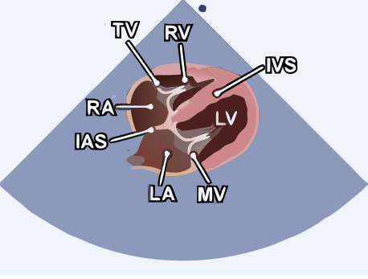{fig-align="center" width="500"}

| Structure | Location in image |
|---|---|
| Liver | Near-field, top left — acoustic window |
| Right ventricle | Nearest the probe, top of the cardiac image |
| Interventricular septum | Separates RV from LV |
| Left ventricle | Deep to the septum |
| Right atrium | Upper right |
| Left atrium | Deepest chamber |
| Tricuspid valve | Between RA and RV |
| Mitral valve | Between LA and LV |
| Pericardium | Bright echogenic line surrounding the heart |

**Choosing the first window:** Subcostal imaging is often accessible in a supine patient. Use the best available window rather than persisting with a poor one. During cardiac arrest, prepare the probe before a scheduled rhythm check and do not prolong interruptions in chest compressions to obtain an image.

#### Subcostal IVC

::: {.callout-tip}

:::

**Acquisition:** From the subcostal four-chamber view, rotate the probe to a sagittal plane (indicator toward the patient's head) and aim slightly toward the patient's right to bring the inferior vena cava into long axis as it drains into the right atrium. The liver serves as the acoustic window.

**How to optimize:**

- Confirm you are imaging the IVC, not the aorta: the IVC is thin-walled, drains directly into the right atrium, and varies with respiration; the aorta is thick-walled, pulsatile, and runs to the patient's left.
- Measure the diameter ~1–2 cm caudal to the IVC–right atrial junction (or just distal to the hepatic vein inlet), keeping the vessel in its true long axis so the diameter is not underestimated.

**Normal anatomy visible:**

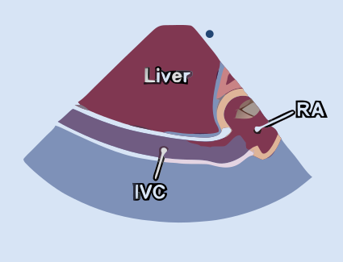{fig-align="center" width="500"}

| Structure | Location in image |
|---|---|
| Inferior vena cava | Long tubular vessel running toward the right atrium |
| IVC–RA junction | Where the IVC enters the right atrium |
| Right atrium | At the IVC inlet |
| Hepatic vein | Drains into the IVC near the RA junction |
| Liver | Surrounds the IVC — acoustic window |

**Why this view matters:** IVC imaging contributes to right atrial pressure and venous congestion assessment. Diameter and respiratory variation do not independently measure circulating volume or predict benefit from fluid. [Module 5](05-ivc.qmd) explains the limitations and dynamic assessment of fluid responsiveness.

---

### Parasternal long axis

::: {.callout-tip}

:::

{fig-align="center" width="380"}

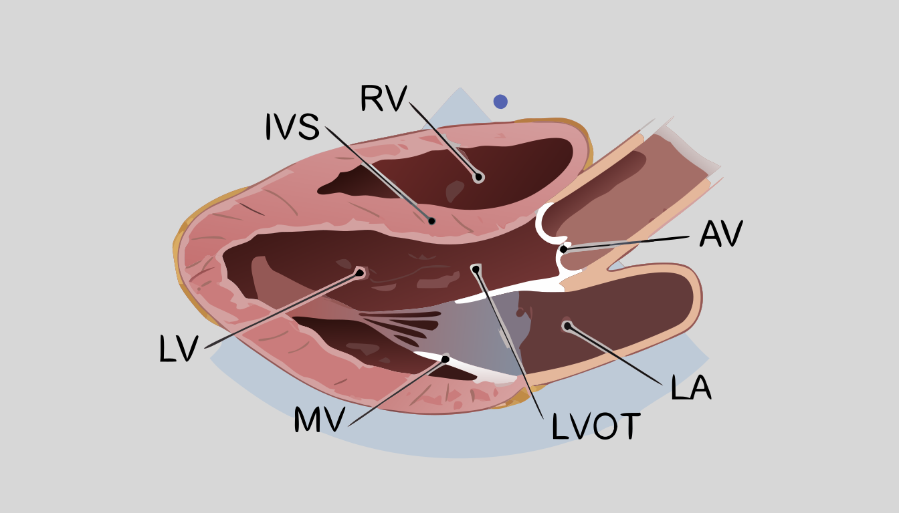{fig-align="center" width="500"}

**How to optimize:**

- Move up or down one interspace to maximize true LV long-axis alignment. The true apex is usually outside standard PLAX; do not rotate into an oblique plane simply to display an apparent apex.
- Tilt the probe slightly medially or laterally to bring the aortic root and LV into the same plane.
- The aortic valve should appear central and open symmetrically in systole.
- The LV walls should appear equal in thickness and the chamber should not appear foreshortened.

**Normal anatomy visible:**

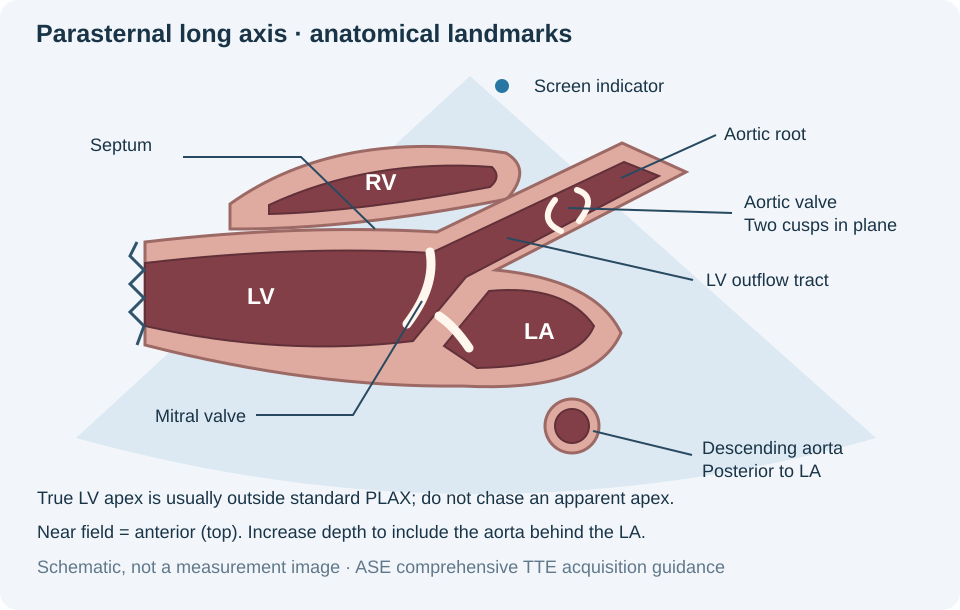{fig-align="center" width="500"}

| Structure | Location in image |
|---|---|
| Right ventricle | Near-field, anterior (top of image) |
| Interventricular septum | Separates RV from LV |
| Left ventricle | Central, posterior to septum |
| Anterior mitral leaflet | Long, swings widely open in diastole |
| Posterior mitral leaflet | Short, moves in opposite direction |
| Left atrium | Posterior, deep |
| Aortic valve | Screen right — usually two cusps in this long-axis plane |
| Aortic root / LVOT | Connects LV to aortic valve |
| Descending thoracic aorta | Round cross-section posterior to the LA when included at sufficient depth |

**Key landmark:** Identify the descending thoracic aorta posterior to the LA. This anatomical relationship helps distinguish pleural from pericardial fluid in [Module 4](04-pericardium.qmd). The aorta may require additional depth to include.

#### PLAX RV inflow

::: {.callout-tip}
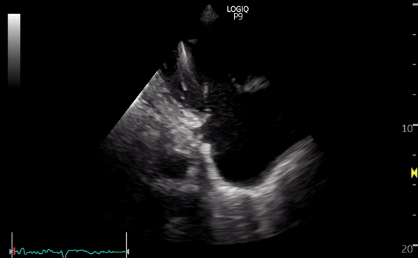
:::

**Acquisition:** From the standard parasternal long axis, angle (rock) the probe inferomedially — tilting the beam toward the patient's right hip — to drop out the left ventricle and bring the right ventricular inflow tract into view. This opens up the right atrium, tricuspid valve, and RV body.

**Normal anatomy visible:**

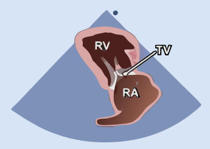{fig-align="center" width="500"}

| Structure | Location in image |
|---|---|
| Right ventricle | Near-field, anterior |
| Right atrium | Far side of the image |
| Tricuspid valve | Between RA and RV — anterior and posterior/septal leaflets |
| Coronary sinus | May be seen entering the RA |
| Eustachian valve / IVC inlet | At the inferior aspect of the RA |

**Why this view matters:** The RV inflow view gives a dedicated look at the tricuspid valve and may align well with a tricuspid regurgitation jet. For velocity measurement, compare available windows and use the best parallel alignment and complete Doppler envelope; no single window is preferred in every patient.

---

### Parasternal short axis

::: {.callout-tip}

- PSAX at the mitral valve level

- PSAX at the papillary muscle level

:::

{fig-align="center" width="380"}

**Fanning between levels:** Tilt the probe toward the right shoulder (base) to image higher cross-sections; tilt toward the left hip (apex) to image lower cross-sections.

**How to optimize:**

- At the papillary muscle level, the LV should appear **round**, not oval. An oval appearance means the plane is slightly oblique — adjust.
- At the aortic valve level, all three cusps should be visible on closure.

**Normal anatomy by level:**

*Aortic valve level (most basal):*

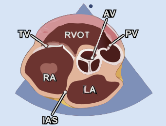{fig-align="center" width="500"}

| Structure | Location |
|---|---|
| Aortic valve | Center — three cusps forming a Y on closure ("Mercedes-Benz sign") |
| Right ventricular outflow tract | Anterior, wrapping around the aorta |
| Pulmonary valve | Anterior, toward screen right |
| Tricuspid valve | Toward screen left |
| Right atrium | Screen left |
| Left atrium | Posterior |

*Mitral valve level:*

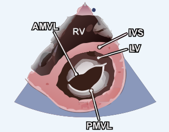{fig-align="center" width="500"}

| Structure | Location |
|---|---|
| Left ventricle | Central — mitral valve visible as a "fish mouth" opening in diastole |
| Right ventricle | Anterior, crescent-shaped |
| Anterior mitral leaflet | Anterior (longer leaflet) |
| Posterior mitral leaflet | Posterior (shorter leaflet) |

*Papillary muscle level (mid-ventricular):*

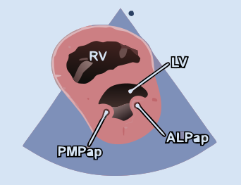{fig-align="center" width="500"}

| Structure | Location |
|---|---|
| Left ventricle | Round, central — the "donut" view |
| Right ventricle | Crescent-shaped, anterior |
| Interventricular septum | Separates RV and LV |
| Anterolateral papillary muscle | Lateral LV wall |
| Posteromedial papillary muscle | Inferior LV wall |

**Why this window matters:** PSAX at the papillary muscle level is the best single view for a quick visual estimate of LV systolic function and for identifying septal flattening from RV pressure or volume overload — both covered in later modules.

---

### Apical four-chamber

::: {.callout-tip}

:::

{fig-align="center" width="380"}

**How to optimize:**

- Left lateral decubitus positioning brings the heart toward the chest wall and significantly improves image quality — use it whenever possible.
- The apex is in the near field, near the top of the image. Set depth to include both atria with a small margin; changing depth does not correct apical foreshortening.
- In obese patients or those with COPD, the PMI may be displaced — palpate rather than assuming position.
- If the view is suboptimal, try moving one interspace lateral or inferior.

**Normal anatomy visible:**

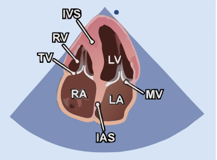{fig-align="center" width="500"}

| Structure | Location in image |
|---|---|
| LV apex | Top center |
| Left ventricle | Screen right |
| Right ventricle | Screen left (normally smaller than LV) |
| Mitral valve | Screen-right AV valve — opens widely in diastole |
| Tricuspid valve | Screen-left AV valve — inserts slightly more apically than mitral |
| Left atrium | Bottom right |
| Right atrium | Bottom left |
| Interventricular septum | Vertical, separates LV and RV |
| Interatrial septum | Thin membrane between LA and RA |

**Key observation:** The tricuspid valve inserts slightly more apically on the interventricular septum than the mitral valve. This normal apical offset reliably identifies which AV valve is which when orientation is uncertain.

#### Apical five-chamber

::: {.callout-tip}

:::

**Acquisition:** Obtained from a well-centered apical four-chamber view by tilting the probe face slightly anteriorly (angling the beam toward the patient's sternum). This rotates the imaging plane forward to bring the left ventricular outflow tract (LVOT) and aortic valve into view — the "fifth chamber" that appears in the center of the image, between the two ventricles.

**How to optimize:**

- Make small tilting adjustments. Too much anterior angulation drops the atria out of the plane; too little fails to open up the LVOT.
- The aortic valve should open and close cleanly in the center of the image, with the LVOT and aortic root aligned roughly vertically toward the apex — this alignment is what makes the view useful for Doppler.

**Normal anatomy visible:**

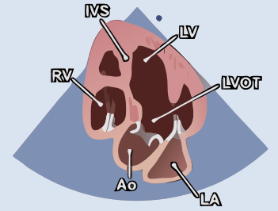{fig-align="center" width="500"}

| Structure | Location in image |
|---|---|
| Left ventricle | Screen right |
| Right ventricle | Screen left |
| LV outflow tract (LVOT) | Center, between the ventricles — the "fifth chamber" |
| Aortic valve | Center, at the base of the LVOT |
| Aortic root | Central, directed up toward the apex |
| Interventricular septum | Between LV and RV |
| Mitral valve | Screen-right AV valve |
| Tricuspid valve | Screen-left AV valve |
| Left atrium | Bottom right (may be partially out of plane) |
| Right atrium | Bottom left |

**Why this view matters:** The apical five-chamber view aligns the ultrasound beam nearly parallel to blood flow through the LVOT and aortic valve. This makes it the standard view for spectral Doppler quantification — the LVOT velocity-time integral (for stroke volume and cardiac output) and aortic valve gradients. These quantitative applications are developed in later modules.

---

## Quiz

::: {.callout-note}
**Q1.** You place the probe at the left parasternal border with the indicator pointing toward the right shoulder. Which window are you in? Name four structures you expect to see.

::: {.callout-caution collapse="true"}
**Answer**
Parasternal long axis (PLAX). Expected structures include: right ventricle (near-field), interventricular septum, left ventricle, anterior and posterior mitral valve leaflets, left atrium, aortic valve, aortic root/LVOT, and the descending thoracic aorta in cross-section posterior to the LA when included at sufficient depth.
:::

**Q2.** You are in PLAX and want to move to PSAX. What do you do with the probe?

::: {.callout-caution collapse="true"}
**Answer**
Rotate the probe 90° clockwise from the PLAX position. The indicator moves from pointing toward the right shoulder to pointing toward the left shoulder (approximately 1–2 o'clock). The imaging plane now cuts the heart in cross-section.
:::

**Q3.** In the subcostal four-chamber view, which cardiac chamber is closest to the probe? What structure serves as the acoustic window?

::: {.callout-caution collapse="true"}
**Answer**
The right ventricle is closest to the probe. The left lobe of the liver serves as the acoustic window.
:::

**Q4.** On PSAX at the aortic valve level, you see three cusps forming a Y-shape on closure. What is this called, and what does it confirm?

::: {.callout-caution collapse="true"}
**Answer**
The Mercedes-Benz sign. It confirms a normal tricuspid aortic valve with three cusps — right coronary, left coronary, and non-coronary. If only two cusps are visible with an oval "fish mouth" opening, consider a bicuspid aortic valve.
:::

**Q5.** In the apical four-chamber view, how do you distinguish the mitral valve from the tricuspid valve?

::: {.callout-caution collapse="true"}
**Answer**
The tricuspid valve inserts slightly more apically on the septum than the mitral valve. With the cardiac display convention taught here, the tricuspid valve/RV/RA are on screen left and the mitral valve/LV/LA are on screen right. Confirm the display indicator and use anatomy rather than screen side alone.
:::

**Q6.** At the papillary muscle level on PSAX, you see two echogenic nodular structures on the LV wall. What are they?

::: {.callout-caution collapse="true"}
**Answer**
The anterolateral and posteromedial papillary muscles. The anterolateral papillary muscle is on the lateral wall; the posteromedial papillary muscle is on the inferior wall. They are the attachment points for the chordae tendineae that tether the mitral valve leaflets.
:::
:::

---

## Video lectures

Full-length teaching lectures from the University of Utah's [Echocardiography & Perioperative Ultrasound](https://echo.anesthesia.med.utah.edu/tee/focus-content/) FoCUS program. Each opens on the Utah ECHO site in a new tab.

<a class="lecture-card" href="https://echo.anesthesia.med.utah.edu/what-is-focus/" target="_blank" rel="noopener">&#9654;What is FoCUS?University of Utah · Echo &amp; Periop Ultrasound</a>
<a class="lecture-card" href="https://echo.anesthesia.med.utah.edu/basic-anatomy/" target="_blank" rel="noopener">&#9654;Basic Anatomy for the EchocardiographerUniversity of Utah · Echo &amp; Periop Ultrasound</a>
<a class="lecture-card" href="https://echo.anesthesia.med.utah.edu/basic-ultrasound-concepts/" target="_blank" rel="noopener">&#9654;Basic Ultrasound ConceptsUniversity of Utah · Echo &amp; Periop Ultrasound</a>
<a class="lecture-card" href="https://echo.anesthesia.med.utah.edu/focus-how-to/" target="_blank" rel="noopener">&#9654;How to Perform the FoCUS Exam (Studio &amp; Live)University of Utah · Echo &amp; Periop Ultrasound</a>

---

## References and further reading

- [ASE comprehensive transthoracic echocardiography guideline, 2019](https://www.asecho.org/wp-content/uploads/2019/01/2019_Comprehensive-TTE.pdf): acquisition, orientation, PLAX and apical anatomy.
- [ASE right-heart guideline, 2025](https://www.asecho.org/wp-content/uploads/2025/03/PIIS0894731725000379.pdf): RV views, Doppler alignment, and IVC interpretation.
- [ASE focused cardiac ultrasound recommendations](https://www.asecho.org/wp-content/uploads/2014/01/FCU.pdf): scope, limitations, and documentation.
