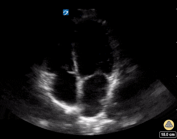

## 1. Clinical question

*What clinical question does this exam answer, and how do findings change management?*

::: {.callout-note}
**The bedside decision frame:** Two questions in order.

1. **Is the RV dilated or failing?** A visually enlarged RV — approaching or exceeding the size of the LV — is the primary finding. Normal RV is roughly two-thirds the size of the LV on apical four-chamber view.
2. **What is the cause, and does it require immediate intervention?** RV failure from massive PE is a needle/catheter emergency. RV failure from chronic pulmonary hypertension or ARDS needs a different approach. The echo does not always give you the diagnosis — it gives you the hemodynamic phenotype to guide management.
:::

The RV is the chamber most often underappreciated in critical care. It operates as a low-pressure, high-compliance structure that tolerates volume overload relatively well but is exquisitely sensitive to acute pressure increases. When RV afterload rises acutely — as in massive PE — the RV dilates rapidly, shifts the interventricular septum, impairs LV filling, and drives the patient into obstructive shock. Recognizing this pattern quickly and accurately is one of the highest-yield skills in critical care echo.

---

## 2. Image acquisition

*Probe, windows, and technique for this module.*

Use a **phased array (cardiac) probe** on the **cardiac preset**. RV assessment requires at least two views. The apical four-chamber is the primary window; PSAX at the mid-ventricular level provides the D-sign. Subcostal is the fallback in unstable patients.

---

### Apical four-chamber — standard and RV-focused

::: {.callout-tip}
Apical four-chamber for RV assessment — RV:LV ratio, free wall motion, TAPSE measurement.

:::

**Two related acquisitions:**

- **Standard A4C** — LV is centered in the sector. Useful for an initial RV:LV size comparison only if the LV is not foreshortened. The RV sits at the edge of the sector and is often clipped, which makes RV size and TAPSE alignment unreliable.
- **RV-focused A4C** — from the standard A4C, slide laterally and rotate slightly so the **RV is centered** in the sector and the full RV free wall from base to apex is in view. ASE guidelines specify the RV-focused view for measuring RV linear dimensions, RV area, and TAPSE. Acquire this view explicitly whenever you intend to quantify RV size or function.

**What you are looking for:** RV size relative to the LV. The RV free wall should move briskly inward in systole. TAPSE (tricuspid annular plane systolic excursion) is measured by M-mode on the **RV-focused view**, with the cursor aligned along the RV free wall as perpendicular to (and through) the lateral tricuspid annulus as possible — normal is greater than 17 mm. Reduced TAPSE indicates RV systolic dysfunction regardless of the cause.

**Avoid the pitfall:** The standard (LV-centered) apical view can foreshorten the LV and artificially make the RV appear larger; conversely, a non-RV-focused acquisition clips the RV and underestimates its size. If RV size or TAPSE matters to the decision, acquire the RV-focused view and confirm in a second window.

---

### Parasternal short axis — mid-ventricular level

::: {.callout-tip}
PSAX for D-sign — normal circular LV vs pressure-overloaded D-shape.

:::

**What you are looking for:** The LV should appear round (like a donut) in cross-section throughout the cardiac cycle. When RV pressure or volume overload is present, the interventricular septum flattens or bows toward the LV, creating a D-shaped LV.

- Septal flattening in **systole**: RV pressure overload (PE, pulmonary hypertension)
- Septal flattening in **diastole**: RV volume overload
- Septal flattening throughout: both

---

### Parasternal long axis — RV outflow

::: {.callout-tip}
PLAX with attention to RV — RV dilation encroaching on the LV, RVOT assessment.

:::

**What you are looking for:** RV free wall thickness (normal <5 mm; >5 mm suggests chronic pressure overload), RVOT dilation, and subjective assessment of RV size relative to LVOT.

---

### Subcostal

::: {.callout-tip}
Subcostal view for RV — free wall, size assessment, RV-to-LV comparison.

:::

**When to use:** First-line in the peri-arrest or ventilated patient. The subcostal view shows the RV nearest the probe and allows rapid assessment of RV size and free wall motion.

---

## 3. Normal & normal variants

::: {.callout-tip}
Normal RV in apical four-chamber — thin free wall, RV smaller than LV, brisk TAPSE. Compare with RV in an athletic heart (mild physiologic enlargement).
:::

### Normal RV size and function

On apical four-chamber, the RV should occupy roughly the right one-third of the image and appear clearly smaller than the LV. The RV free wall is thin and moves vigorously. TAPSE is greater than 17 mm. Normal RV wall thickness on subcostal is less than 5 mm.

### Physiologic RV enlargement

Highly trained athletes may have mildly enlarged RVs — a normal variant without functional impairment. TAPSE and free wall motion remain normal. Clinical context distinguishes this from pathologic enlargement.

### RV hypertrophy

Free wall thickness greater than 5 mm indicates chronic pressure overload. The RV has remodeled over time. Seen in chronic pulmonary hypertension, severe COPD, and longstanding left heart disease. A hypertrophied RV tolerates acute pressure increases somewhat better than a normal-thickness RV, which is why patients with chronic PHT may tolerate elevated PA pressures that would immediately cause acute cor pulmonale in a previously healthy patient.

---

## 4. Pathology library

*Organized by finding, not by diagnosis.*

### RV dilation

::: {.callout-tip}
Dilated RV on apical four-chamber — RV approaching or exceeding LV size.

:::

RV:LV ratio approaching 1:1 or greater on apical four-chamber is abnormal. The RV free wall may still contract (compensated) or may be hypokinetic (decompensated).

**Teaching points:**

- Acute dilation without free wall hypertrophy = acute process (PE, acute cor pulmonale from ARDS, RV infarct).
- Dilation with free wall hypertrophy = chronic process (pulmonary hypertension, COPD).
- The acuity of onset changes the differential and the urgency of intervention.

---

### D-sign (septal flattening)

::: {.callout-tip}
- D-sign from pressure overload (systolic flattening) — PE, PHT
- D-sign from volume overload (diastolic flattening) — TR, ASD

:::

The interventricular septum flattens or bows toward the LV due to elevated RV pressure or volume. The timing within the cardiac cycle distinguishes pressure from volume overload.

**Teaching points:**

- Septal shift impairs LV filling (ventricular interdependence) and can cause hypotension even with a structurally normal LV.
- The D-sign is most reliably assessed on PSAX.
- In mechanical ventilation, the D-sign may be accentuated by high PEEP and should be interpreted in clinical context.

---

### McConnell's sign

::: {.callout-tip}
McConnell's sign — RV free wall hypokinesis with apical sparing (apical flicking).

:::

Regional RV dysfunction with akinesis of the mid-free wall and preserved or hyperdynamic motion at the RV apex. Originally described as specific for acute PE (specificity ~94%, sensitivity ~77%). The mechanism is thought to involve tethering of the RV apex to the contracting LV.

**Teaching points:**

- Highly specific for acute PE when present, but absence does not rule out PE.
- Can be seen in other conditions causing acute RV pressure overload.
- In the right clinical context (tachycardia, hypoxia, plethoric IVC), McConnell's sign is enough to initiate PE workup and consider empiric thrombolytics in an unstable patient.

---

### Reduced TAPSE

::: {.callout-tip}
TAPSE measurement by M-mode — normal vs reduced.
:::

TAPSE below 17 mm indicates RV systolic dysfunction. It reflects longitudinal RV function and correlates with prognosis across multiple conditions including PE, pulmonary hypertension, and right heart failure.

**Teaching points:**

- TAPSE is load-dependent — it can be reduced in hypovolemia and improved with volume loading.
- A TAPSE of 10 mm in a patient who was normal yesterday represents a severe acute event.
- Serial TAPSE measurement tracks RV recovery in response to treatment.

---

### Mimics & pitfalls

| Pitfall | Explanation |
|---|---|
| Foreshortened apical view | Makes RV appear artificially large; confirm in a second window |
| Anterior MI with RV involvement | RV dilation from infarct, not PE — ECG and clinical context distinguish |
| Athletic heart | Mild RV enlargement without functional impairment |
| High PEEP | Can cause RV dilation and D-sign independent of intrinsic RV pathology |
| RBBB | Can cause apparent septal dyskinesis on echo unrelated to pressure overload |

---

## 5. Integration cases

*Cases where the finding changes management.*

---

### Case 1: Massive PE — hemodynamic collapse

**Clinical scenario:** A 55-year-old man on a long-haul flight arrives at a connecting airport and collapses in the terminal. He is brought to the ED with BP 70/40, HR 130, O2 saturation 84% on non-rebreather. ECG shows sinus tachycardia with right heart strain pattern (S1Q3T3).

**What exam would you perform?**
Immediate subcostal cardiac view and IVC.

::: {.callout-tip}
Loops for interpretation.
:::

**What you see:**
Massively dilated RV, RV:LV ratio >1. McConnell's sign present. D-sign on PSAX. Plethoric, non-collapsing IVC. No pericardial effusion.

**How does this change management?**
This is massive PE with obstructive shock. The echo is sufficient to act — do not wait for CT. Administer systemic thrombolytics (tPA 100 mg over 2 hours or 50 mg bolus if arrest is imminent) unless there is a hard contraindication. If contraindicated, activate interventional radiology or cardiac surgery for catheter-directed therapy or surgical embolectomy. Avoid large fluid boluses — the dilated RV cannot accommodate more volume and fluids may worsen septal shift and LV underfilling.

---

### Case 2: Submassive PE — how sick is this RV?

**Clinical scenario:** A 42-year-old woman presents with 3 days of pleuritic chest pain and progressive dyspnea. BP 108/72, HR 105, O2 saturation 92% on room air. CT confirms bilateral PE with clot in the main pulmonary arteries. Troponin is positive.

**What exam would you perform?**
Focused cardiac ultrasound to assess RV function and guide risk stratification.

::: {.callout-tip}
Loops for interpretation.

:::

**What you see:**
Mildly to moderately dilated RV. RV free wall hypokinesis present. No McConnell's sign. TAPSE 12 mm. D-sign on PSAX. LV filling appears reduced.

**How does this change management?**
This is submassive (intermediate-high risk) PE with echo evidence of RV dysfunction and myocardial injury (elevated troponin). Anticoagulate immediately. The RV dysfunction on echo upgrades risk and supports consideration of early catheter-directed therapy rather than anticoagulation alone. Admit to a monitored setting. Serial echo is appropriate to track RV recovery.

---

### Case 3: ARDS and RV failure

**Clinical scenario:** A 67-year-old man with severe ARDS (P:F ratio 90) is on lung-protective ventilation with PEEP 16 and FiO2 0.80. He is increasingly vasopressor-dependent on day 3 of his ICU course. No new fever or culture data.

**What exam would you perform?**
Bedside cardiac ultrasound to assess for ventilator-induced cor pulmonale.

::: {.callout-tip}
Loops for interpretation.
:::

**What you see:**
RV dilated, RV:LV ratio 0.9. D-sign present throughout the cardiac cycle. TAPSE 13 mm. No McConnell's sign. Plethoric IVC.

**How does this change management?**
Acute cor pulmonale from ARDS. High PEEP increases RV afterload; hypercapnia causes pulmonary vasoconstriction and worsens it further. Interventions: reduce PEEP if oxygenation allows, target normocapnia, consider prone positioning (reduces RV afterload and improves V/Q matching), inhaled pulmonary vasodilators (inhaled NO or epoprostenol) to reduce RV afterload. Avoid further fluid loading.

---

### Case 4: RV infarct

**Clinical scenario:** A 70-year-old man with an inferior STEMI (ST elevation in II, III, aVF) is being transferred for primary PCI. His BP is 82/54 and HR 88. He received sublingual nitroglycerin in the field and his BP dropped to 60 systolic briefly.

**What exam would you perform?**
Rapid focused cardiac echo before transfer.

::: {.callout-tip}
Loops for interpretation.
:::

**What you see:**
Inferior and posterior wall hypokinesis (LV). RV free wall hypokinesis. RV mildly dilated. LV function otherwise preserved.

**How does this change management?**
RV infarct complicating inferior STEMI. Nitroglycerin is contraindicated — it reduces preload and the failing RV is entirely preload-dependent. Administer IV fluid bolus (500 mL) to maintain RV filling pressure. Avoid diuretics. Maintain AV synchrony — loss of atrial kick is poorly tolerated. Expedite PCI — reperfusion of the RCA is the treatment.

::: {.callout-tip}
**Case format reminder:** The case ends with a management decision, not just a diagnosis.
:::

---

## Quiz

::: {.callout-note}
**Q1.** On apical four-chamber, the RV appears as large as the LV. What is your next step before concluding RV dilation is present?

::: {.callout-caution collapse="true"}
**Answer**
Confirm in a second window. The apical view can foreshorten the LV and artificially make the RV appear large. PSAX or subcostal view should confirm the finding before acting on it.
:::

**Q2.** The D-sign is present in systole but resolves in diastole on PSAX. What does this pattern indicate?

::: {.callout-caution collapse="true"}
**Answer**
Systolic septal flattening indicates RV pressure overload — the RV systolic pressure is elevated above normal (e.g., massive PE, acute pulmonary hypertension). Diastolic flattening indicates volume overload. Flattening throughout the cycle suggests combined pressure and volume overload.
:::

**Q3.** What is McConnell's sign and what condition is it most associated with?

::: {.callout-caution collapse="true"}
**Answer**
McConnell's sign is akinesis of the RV mid-free wall with preserved or hyperdynamic motion at the RV apex. It is most associated with acute pulmonary embolism (specificity ~94%). The mechanism involves tethering of the RV apex to the contracting LV apex through shared myocardial fibers.
:::

**Q4.** A patient with massive PE and obstructive shock has a BP of 68/40. Why should you avoid large fluid boluses?

::: {.callout-caution collapse="true"}
**Answer**
The RV is already severely distended. Additional volume causes further RV dilation, worsens D-sign and septal shift, reduces LV diastolic filling, and drops cardiac output further. A small bolus (250–500 mL) may be given as a bridge, but the primary intervention is restoring RV afterload reduction through thrombolysis or mechanical reperfusion.
:::

**Q5.** TAPSE is measured at 10 mm in a patient with known chronic pulmonary hypertension. How does this differ from the same TAPSE in a patient who was normal yesterday?

::: {.callout-caution collapse="true"}
**Answer**
In chronic PHT, a TAPSE of 10 mm may represent stable (if severely impaired) chronic RV dysfunction. In a previously normal patient, TAPSE of 10 mm represents acute, severe RV failure — the RV has not had time to compensate and the patient is at immediate risk of hemodynamic collapse. Acute RV failure is a medical emergency; chronic RV dysfunction requires optimization but is not immediately life-threatening in the same way.
:::
:::
