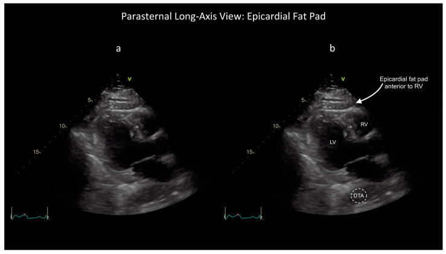

## 1. Clinical question

*What clinical question does this exam answer, and how do findings change management?*

::: {.callout-note}
**The bedside decision frame:** Answer three questions in order.

1. **Is there a pericardial effusion?** Confirm an echo-free space in at least two views and distinguish it from pleural fluid, fat, and ascites.
2. **Is cardiac filling impaired?** Size alone does not determine significance. Integrate right-sided chamber collapse, IVC plethora, Doppler respiratory variation, and the patient's hemodynamics.
3. **What needs to happen now?** An unstable patient with an effusion and tamponade physiology needs immediate specialist activation for drainage. A stable patient may need comprehensive echocardiography, monitoring, and treatment of the cause instead.
:::

POCUS rapidly detects pericardial fluid and signs of hemodynamic effect. It does **not** diagnose tamponade from effusion size alone, exclude a loculated post-operative collection after one normal window, or establish acute pericarditis by itself. The final interpretation is the combination of ultrasound, physiology, and clinical context.

---

## 2. Image acquisition

*Probe, windows, and technique for this module.*

Use a **phased array (cardiac) probe** on the **cardiac preset**. Start with the window that is fastest and clearest in the patient in front of you; the subcostal view is often first in an unstable supine patient. PLAX, PSAX, and apical views provide complementary information.

**Depth and gain:** Keep the entire cardiac silhouette and posterior pericardium on screen with a small margin beyond it. Too little depth can clip a posterior effusion; excessive gain can make simple fluid look echogenic.

**Measurement:** Describe location and distribution, then measure the largest echo-free separation at end-diastole. The traditional semiquantitative categories are small (<10 mm), moderate (10–20 mm), and large (>20 mm). Record the view and site of measurement rather than treating one number as an estimate of volume.

---

### Subcostal four-chamber

::: {.callout-tip}

:::

The RV free wall is nearest the probe. Fan through the entire cardiac silhouette, watching the RA free wall through systole and the RV free wall at the start of diastole. Extend the same window inferiorly to assess the IVC.

---

### Parasternal long axis

::: {.callout-tip}

:::

Effusion on PLAX commonly appears as an echo-free stripe posterior to the LV. **Key landmark:** the descending thoracic aorta in cross-section near the left atrium. Pericardial fluid remains anterior to the descending aorta; left pleural fluid extends posterior to it.

---

### Apical four-chamber

::: {.callout-tip}

:::

The apical view helps define circumferential or loculated fluid and shows RA free-wall motion well. Avoid an off-axis view that foreshortens the ventricles or mistakes pleural fluid for pericardial fluid.

---

## 3. Recognizing effusion and common mimics

### Normal pericardium

::: {.callout-tip}

:::

A thin, bright (hyperechoic) line surrounds the heart and moves with it. A physiologic trace of fluid can appear as a very thin posterior stripe on PLAX. Do not call a pathologic effusion from one equivocal view.

### Pericardial and epicardial fat

::: {.callout-tip}

:::

*Annotated PLAX example: [Bronshteyn et al., Diagnostics 2024](https://pmc.ncbi.nlm.nih.gov/articles/PMC11049036/#diagnostics-14-00818-f002) ([CC BY 4.0](https://creativecommons.org/licenses/by/4.0/)).*

Fat is the most common mimic of pericardial fluid. It is usually **echogenic or speckled**, most prominent anteriorly, and not a uniformly anechoic collection.

- A superficial pericardial fat pad is relatively fixed.
- Epicardial fat moves with the heart and sits between myocardium and visceral pericardium.
- Free-flowing effusion changes distribution with gravity; a loculated effusion may not.

---

### Small effusion

::: {.callout-tip}

:::

Less than 10 mm in maximal end-diastolic separation. A small effusion may be visible only posteriorly or in one dependent region.

**Teaching points:**

- Usually does not produce chamber collapse, but a rapidly accumulating or loculated collection can be important despite a small measured width.
- Common causes include pericarditis, malignancy, uremia, trauma, and recent procedures.
- In a patient with pleuritic chest pain, a new effusion supports acute pericarditis but does not establish the diagnosis on its own.

---

### Moderate to large effusion

::: {.callout-tip}

:::

Moderate: 10–20 mm; large: >20 mm at end-diastole. Large free-flowing effusions are often circumferential and visible in several windows.

**Teaching points:**

- A "swinging heart" is a clue to a very large effusion, but chamber collapse and clinical physiology determine urgency.
- Size does not equal tamponade. A large chronic effusion may be tolerated because the pericardium has stretched. A rapidly accumulating effusion can cause tamponade at a much smaller volume.
- Always assess chamber collapse, IVC, respiratory interaction, and blood pressure when an effusion is present.

---

### Loculated effusion

::: {.callout-tip}

:::

Loculated effusions do not distribute freely. They occur after cardiac surgery, trauma, or prior pericarditis with adhesions. The collection may compress only one chamber and produce regional tamponade without the classic pattern.

**Teaching points:**

- A normal subcostal view does not exclude a loculated collection; check all windows.
- Echogenic or heterogeneous fluid suggests blood, clot, debris, or exudate.
- Obtain urgent comprehensive imaging and specialist input. A loculated collection may require a different drainage route or surgery.

---

### Post-operative appearance

After cardiac surgery, adhesions can produce anterior, loculated, or regional collections. Classic findings may be absent, and TTE windows may be limited. New post-operative hemodynamic instability with an equivocal bedside exam warrants urgent comprehensive echo—often TEE—and surgical evaluation.

---

### Mimics and pitfalls

| Mimic | Key distinguishing feature |
|---|---|
| Left pleural effusion | Extends posterior to the descending aorta on PLAX |
| Pericardial or epicardial fat | Echogenic or speckled rather than uniformly anechoic; often anterior |
| Ascites | Lies below the diaphragm and does not surround the heart |
| Right pleural effusion | Lateral to the RA/RV on subcostal imaging; does not wrap around the heart |
| Severely dilated coronary sinus | Tubular structure in the posterior AV groove; confirm in orthogonal views and with Doppler |

---

## 4. Tamponade physiology

### Tamponade physiology

::: {.callout-tip}

:::

Tamponade occurs when pericardial pressure impairs cardiac filling and reduces stroke volume. It is a **clinical-hemodynamic diagnosis supported by ultrasound**. No single finding is diagnostic in isolation.

| Finding | Best view | Interpretation |
|---|---|---|
| Pericardial effusion | Any two cardiac views | Required for effusive tamponade; size alone does not define severity |
| RA free-wall collapse | Subcostal or apical | Often the earliest finding; longer collapse is more specific |
| RV free-wall collapse in early diastole | PLAX, PSAX, or subcostal | More specific sign of elevated pericardial pressure |
| Plethoric IVC with reduced inspiratory collapse | Subcostal IVC | Sensitive for elevated RA pressure but nonspecific |
| Exaggerated respiratory ventricular interaction | PSAX and apical Doppler | >25% mitral E-wave decrease and >40% tricuspid E-wave increase during inspiration in spontaneous breathing |

#### Doppler respiratory variation

::: {.callout-tip}

:::

From the apical four-chamber view, place the PW Doppler sample at the mitral leaflet tips and record several respiratory cycles at a slow sweep speed. In spontaneous breathing, tamponade can produce a **>25% inspiratory fall in mitral E-wave velocity** and a reciprocal **>40% inspiratory rise in tricuspid E-wave velocity**.

These thresholds are supportive, not standalone diagnostic tests. Atrial fibrillation, tachypnea, high respiratory effort, and positive-pressure ventilation make interpretation less reliable; during positive-pressure ventilation the expected pattern can be blunted or reversed.

::: {.callout-warning}
**Context can hide classic signs.** Pulmonary hypertension or severe RV hypertrophy can prevent right-sided collapse. Hypovolemia can produce low-pressure tamponade without a plethoric IVC. Positive-pressure ventilation alters Doppler respiratory variation. Loculated or post-operative collections may compress only one chamber.
:::

**Management implication:** In a hemodynamically unstable patient with a compatible effusion and tamponade physiology, activate the team capable of definitive drainage immediately. Pericardiocentesis, surgical drainage, or operative repair depends on cause, location, and local expertise. Use cautious volume or vasopressor support only as a bridge when needed; neither relieves the obstruction. Comprehensive echo is valuable when it can be obtained without delaying source control.

---

## 5. Integration cases

*Cases where the finding changes management.*

---

### Case 1: Post-procedure hypotension

**Clinical scenario:** A 68-year-old man undergoes right heart catheterization for pulmonary hypertension workup. Thirty minutes later he is hypotensive (BP 82/50), tachycardic (HR 118), and diaphoretic.

**What exam would you perform?**
Focused cardiac ultrasound, subcostal view first.

::: {.callout-tip}

:::

**What you see:**
Large circumferential effusion. RA free wall collapses in systole. RV collapse begins in early diastole. IVC is 2.4 cm with minimal inspiratory collapse.

**How does this change management?**
Activate interventional cardiology and cardiac surgery immediately and prepare for definitive drainage. Avoid repeated empiric fluid boluses; a cautious bolus or vasopressor may support preload and perfusion only while the drainage team mobilizes. Neither is definitive therapy.

---

### Case 2: Dyspnea in a cancer patient

**Clinical scenario:** A 54-year-old woman with metastatic lung adenocarcinoma presents with two weeks of worsening exertional dyspnea and chest fullness. BP 104/72, HR 102. JVD is present, and CXR shows an enlarged cardiac silhouette.

**What exam would you perform?**
Focused cardiac ultrasound using subcostal and PLAX views at minimum.

::: {.callout-tip}

:::

**What you see:**
Large pericardial effusion in PLAX without visible RV free-wall collapse in this loop. Effusion size alone does not establish tamponade; integrate right-sided chamber behavior in multiple views, IVC findings, Doppler, and the clinical examination.

**How does this change management?**
This very large, symptomatic malignant effusion needs urgent comprehensive echocardiography, monitored admission, and oncology/cardiology consultation. The absence of chamber collapse lowers the likelihood of overt tamponade at this moment but does not make discharge safe. The team should define a drainage plan and reassess promptly if physiology changes.

---

### Case 3: Undifferentiated shock in the ED

**Clinical scenario:** A 44-year-old man arrives after being found unresponsive. BP 70/40, HR 124, GCS 10. He is cool and mottled with distended neck veins.

**What exam would you perform?**
Immediate focused cardiac ultrasound as part of resuscitation.

::: {.callout-tip}

:::

**What you see:**
Moderate effusion. RA collapse is present; RV collapse is not clear because image quality is limited.

**How does this change management?**
Activate the drainage team and treat this as obstructive shock. Avoid unnecessary deep sedation and positive-pressure ventilation because both can reduce venous return and precipitate collapse. If cardiac arrest occurs, continue high-quality resuscitation while the team rapidly relieves tamponade; treat a shockable rhythm when present and address the reversible cause without delay.

---

### Case 4: Dialysis patient with chest pain

**Clinical scenario:** A 62-year-old man on hemodialysis presents with sharp chest pain worse when lying flat after missing two sessions. Vitals are stable. ECG shows diffuse ST elevation with PR depression.

**What exam would you perform?**
Focused cardiac ultrasound to assess for effusion and tamponade physiology.

::: {.callout-tip}

:::

**What you see:**
Small-to-moderate posterior effusion. No chamber collapse. IVC is 2.5 cm, consistent with elevated right atrial pressure in this clinical context.

**How does this change management?**
Suspect uremic pericarditis with a small-to-moderate effusion and no current tamponade. Coordinate urgent nephrology and cardiology evaluation; intensified dialysis is usually first-line when there is no tamponade. Admit for monitoring and repeat imaging. Drainage is required if tamponade develops or the effusion enlarges despite treatment.

---

### Case 5: Thoracic trauma

**Clinical scenario:** A 29-year-old woman is intubated after a high-speed MVC. BP 88/60 on vasopressors, HR 135. Bilateral breath sounds are present.

**What exam would you perform?**
eFAST with the focused cardiac view prioritized during the resuscitation.

::: {.callout-tip}

:::

**What you see:**
Pericardial fluid anterior to the RV with RV diastolic collapse. No pleural fluid is seen.

**How does this change management?**
Hemopericardium with tamponade physiology in an unstable trauma patient requires immediate trauma and cardiothoracic surgical activation; do not delay source control for CT. Pericardiocentesis may be an imperfect bridge when surgical access is delayed because clotted blood may not drain. If arrest occurs, resuscitative thoracotomy is selected according to injury mechanism, signs of life, arrest duration, local protocol, and team capability—not from the ultrasound finding alone.

---

### Case 6: Recurrent chest pain after pericarditis

**Clinical scenario:** A 35-year-old man treated for acute pericarditis three months ago returns with recurrent pleuritic chest pain and low-grade fever. His prior small effusion resolved on follow-up.

**What exam would you perform?**
Focused cardiac ultrasound to assess for recurrent effusion, tamponade physiology, and LV function.

::: {.callout-tip}

:::

**What you see:**
Small posterior effusion. No tamponade physiology. Normal LV function.

**How does this change management?**
Recurrent pericarditis is likely, with a small effusion and no tamponade physiology. Obtain ECG, inflammatory markers, and troponin; review renal, bleeding, and medication risks; and start guideline-directed anti-inflammatory therapy with cardiology follow-up. Recurrent or refractory disease may require advanced imaging or targeted therapy.

::: {.callout-tip}
**Case format reminder:** The case ends with a management decision, not just a diagnosis.
:::

---

## Quiz

::: {.callout-note}
**Q1.** On PLAX, you see an echo-free space posterior to the LV. How do you determine whether it is pericardial or pleural?

::: {.callout-caution collapse="true"}
**Answer**
Locate the descending thoracic aorta in cross-section near the left atrium. Pericardial fluid remains **anterior** to the descending aorta; left pleural fluid extends **posterior** to it.
:::

**Q2.** A patient has a large effusion and is hypotensive. RV diastolic collapse is not clearly visible. What other findings support tamponade physiology?

::: {.callout-caution collapse="true"}
**Answer**
RA free-wall collapse, a plethoric IVC with reduced inspiratory collapse, exaggerated ventricular interdependence, a >25% inspiratory fall in mitral E-wave velocity, and a >40% inspiratory rise in tricuspid E-wave velocity support tamponade in spontaneous breathing. No single finding is required, and positive-pressure ventilation can alter the pattern.
:::

**Q3.** You see an echogenic structure anterior to the RV. What is the most likely mimic, and how do you confirm it?

::: {.callout-caution collapse="true"}
**Answer**
Pericardial or epicardial fat. Confirm the speckled echogenic texture, anterior location, and motion with the heart. Compare multiple views and reduce gain. Free-flowing fluid may redistribute with position, but a loculated effusion may not.
:::

**Q4.** A patient with metastatic cancer has a large effusion but no definite chamber collapse. Is discharge safe?

::: {.callout-caution collapse="true"}
**Answer**
No. A very large symptomatic malignant effusion needs urgent comprehensive echocardiography, monitored evaluation, and a specialist drainage plan. Chamber collapse can be absent early or masked by elevated right-sided pressure.
:::

**Q5.** Which features in acute pericarditis favor hospital evaluation?

::: {.callout-caution collapse="true"}
**Answer**
Fever >38°C, subacute course, large effusion (>20 mm), tamponade, failure of initial anti-inflammatory therapy, myocardial involvement, immunosuppression, trauma, and oral anticoagulant therapy favor hospital evaluation.
:::

**Q6.** In traumatic tamponade, why is pericardiocentesis often insufficient?

::: {.callout-caution collapse="true"}
**Answer**
Traumatic hemopericardium may represent cardiac or great-vessel injury and can contain clot that will not drain through a needle or catheter. Pericardiocentesis may be only a bridge when surgery is not immediately available; definitive hemorrhage control usually requires operative repair.
:::
:::

---

## Video resources

These external teaching resources reinforce effusion recognition and the integrated assessment of tamponade physiology. Each opens on the publisher's site in a new tab.

<a class="lecture-card" href="https://medicine.yale.edu/media-player/focus/" target="_blank" rel="noopener">&#9654;Focused Cardiac UltrasoundYale School of Medicine</a>
<a class="lecture-card" href="https://www.acep.org/emultrasound/newsroom/may-2024/cardiac-tamponade" target="_blank" rel="noopener">&#9654;Cardiac TamponadeAmerican College of Emergency Physicians</a>

---

## References & further reading

- Schulz-Menger J, et al. [2025 ESC Guidelines for the management of myocarditis and pericarditis](https://doi.org/10.1093/eurheartj/ehaf192). *European Heart Journal*. 2025.
- Wang TKM, et al. [2025 Concise Clinical Guidance: An ACC Expert Consensus Statement on the Diagnosis and Management of Pericarditis](https://doi.org/10.1016/j.jacc.2025.05.023). *Journal of the American College of Cardiology*. 2025.
- Klein AL, et al. [American Society of Echocardiography Clinical Recommendations for Multimodality Cardiovascular Imaging of Patients with Pericardial Disease](https://www.asecho.org/guideline/pericardial-disease/). *Journal of the American Society of Echocardiography*. 2013.
- American Heart Association. [2025 Guidelines for CPR and ECC: Adult and Pediatric Special Circumstances of Resuscitation](https://cpr.heart.org/en/resuscitation-science/cpr-and-ecc-guidelines/adult-and-pediatric-special-circumstances-of-resuscitation). 2025.
- Eastern Association for the Surgery of Trauma. [Emergency Department Thoracotomy Practice Management Guideline](https://www.east.org/education-resources/practice-management-guidelines/details/emergency-department-thoracotomy). 2015.
