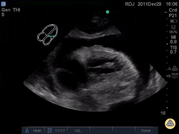

## 1. Clinical question

*What clinical question does this exam answer, and how do findings change management?*

::: {.callout-note}
**The bedside decision frame:** Three questions in order.

1. **Is there a pericardial effusion?** An echo-free space surrounding the heart — confirmed in at least two views before acting on it.
2. **Is it physiologically significant?** Size alone does not determine significance. Look for chamber collapse, plethoric IVC, and respiratory variation — the hallmarks of elevated intrapericardial pressure.
3. **Does this change what you do right now?** Tamponade is a clinical and sonographic diagnosis. A large effusion in a hemodynamically stable patient may warrant monitoring and urgent cardiology consultation. The same effusion in a hypotensive patient with RA collapse is a needle emergency.

Two further questions apply in the non-acute setting:

4. **Is this pericarditis, and does it require intervention?** Echo defines the effusion, tracks its size, and identifies patients at highest risk.
5. **Is this constrictive pericarditis?** Constriction is the great mimic of right heart failure and the one pericardial diagnosis that requires surgical intervention.
:::

Pericardial ultrasound answers a binary, time-sensitive question at the bedside: **does this patient need pericardiocentesis now?** It also identifies effusions that will influence resuscitation strategy — for example, recognizing that aggressive fluid loading in tamponade provides only a brief bridge, and that vasopressors are a temporizing measure, not a solution. In the subacute setting, recognizing pericarditis and constriction prevents missed diagnoses that carry significant long-term consequences.

---

## 2. Image acquisition

*Probe, windows, and technique for this module.*

Use a **phased array (cardiac) probe** on the **cardiac preset**. The four standard windows are covered in Module 1. For pericardial assessment, the subcostal view is obtained first in an unstable patient; PLAX and apical four-chamber provide complementary information. This module adds Doppler assessment for constrictive physiology.

**Depth:** Ensure the posterior pericardium is fully visible with a small margin beyond it. A common error is insufficient depth that clips the posterior effusion.

---

### Subcostal four-chamber — pericardial assessment

::: {.callout-tip}
**Video slot:** Subcostal view for pericardial assessment — effusion, RA free wall collapse, RV diastolic collapse.
:::

The RV free wall is nearest the probe, making the subcostal view the best window for detecting RA and RV chamber collapse in tamponade. The entire pericardium can be surveyed by fanning through the cardiac silhouette.

---

### Parasternal long axis — pericardial assessment

::: {.callout-tip}
**Video slot:** PLAX for pericardial assessment — posterior effusion, descending aorta landmark, effusion sizing.

:::

Effusion on PLAX appears as an echo-free stripe posterior to the LV. **Key landmark:** the descending thoracic aorta in cross-section at the far left of the image. Fluid anterior to the aorta is pericardial; fluid posterior to the aorta is pleural.

---

### Apical four-chamber — pericardial assessment

::: {.callout-tip}
**Video slot:** Apical four-chamber for pericardial assessment — circumferential effusion, RA collapse, respiratory variation on mitral inflow.
:::

The apical view is useful for identifying loculated effusions and for PW Doppler assessment of respiratory variation across the mitral valve in suspected tamponade.

---

## 3. Normal & normal variants

::: {.callout-tip}
**Video slots:** Normal pericardium in each window. Normal mitral inflow Doppler. Normal hepatic vein flow.

:::

### Normal pericardium

A thin, bright (hyperechoic) line surrounding the heart that moves with it. No echo-free space between the visceral and parietal layers. A physiologic trace of fluid (up to 50 mL) may appear as a very thin stripe posteriorly on PLAX — this does not warrant intervention.

### Pericardial fat pad

The most common mimic of pericardial effusion. Pericardial fat is **echogenic** (bright, not black), most prominent anteriorly, and does not shift with patient repositioning. Key distinguishing features:

- Fat is echogenic; effusion is anechoic.
- Fat does not change with the cardiac cycle; effusion may show swirling.
- Fat is anterior; hemodynamically significant effusions tend to be circumferential and posterior.

### Epicardial fat

Sits between the myocardium and the visceral pericardium. Visible as a thin echogenic layer over the RV free wall and in the AV groove. Moves with the heart (unlike pericardial fat pad, which is relatively fixed). Differentiated from a small effusion by echogenicity and motion pattern.

### Post-CABG appearance

After cardiac surgery, the pericardium is often left open or partially closed, creating atypical appearances with adhesions and thickening. Post-operative effusions are frequently anterior and loculated. Subcostal view may be normal — always check all windows in post-surgical patients with new hemodynamic instability.

---

## 4. Pathology library

*Organized by finding, not by diagnosis.*

### Small effusion

::: {.callout-tip}
**Video slot:** Small posterior effusion on PLAX — thin echo-free stripe, preserved chamber function.
:::

Less than 1 cm in greatest diameter on PLAX, posterior to the LV. Visible in diastole; may thin or disappear in systole.

**Teaching points:**

- Accumulates posteriorly first — the most dependent space in the supine patient.
- Does not produce chamber collapse.
- Causes: pericarditis, viral illness, malignancy, uremia, post-procedure.
- In the right clinical context (pleuritic chest pain, friction rub), a small effusion supports acute pericarditis and warrants NSAIDs and follow-up imaging — not drainage.

---

### Moderate to large effusion

::: {.callout-tip}
**Video slot:** Large circumferential effusion — swinging heart, echo-free space in all windows.

:::

Moderate: 1–2 cm; large: >2 cm on PLAX. Large effusions are typically circumferential and visible in all windows.

**Teaching points:**

- The "swinging heart" — pendular cardiac motion within the effusion — is a marker of significant hemodynamic risk.
- Size does not equal tamponade. A large chronic effusion (e.g., malignant) may be tolerated because the pericardium has had time to stretch. An acute effusion of even 200 mL (e.g., post-procedure, trauma) can cause tamponade because the pericardium has not had time to accommodate.
- Always assess chamber collapse and IVC when a large effusion is present.

---

### Tamponade physiology

::: {.callout-tip}
**Video slots:**
- RA free wall collapse in systole (subcostal or apical)
- RV diastolic collapse (PLAX or subcostal)
- Plethoric, non-collapsing IVC
- Respiratory variation on mitral inflow (M-mode or PW Doppler)

:::

Tamponade is elevated intrapericardial pressure exceeding intracardiac filling pressure. It is a clinical diagnosis confirmed sonographically. No single finding is pathognomonic — the diagnosis is integrative.

**Sonographic findings, in order of sensitivity:**

| Finding | View | Notes |
|---|---|---|
| RA free wall collapse (systole) | Subcostal, apical | Earliest sign; sensitive but not specific |
| RV diastolic collapse | PLAX, subcostal | More specific; correlates with pressure equalization |
| Plethoric IVC (>2.1 cm, <50% collapse) | Subcostal IVC view | Reflects elevated right-sided filling pressures |
| Respiratory variation on mitral inflow >25% | Apical, PW Doppler | Sonographic equivalent of pulsus paradoxus |

**Management implication:** When tamponade physiology is present in a hemodynamically unstable patient, the exam is over. Call for pericardiocentesis or emergent cardiothoracic surgery depending on the clinical context. Do not delay for formal echo.

---

### Loculated effusion

::: {.callout-tip}
**Video slot:** Post-operative loculated effusion — anterior, irregular, compressing a single chamber.

:::

Loculated effusions do not distribute freely. They occur after cardiac surgery, trauma, or prior pericarditis with adhesions. The collection may compress only one chamber, producing atypical hemodynamic presentations that do not fit classic tamponade physiology.

**Teaching points:**

- Subcostal view may appear normal; always check all windows.
- Echogenic or heterogeneous fluid suggests blood, clot, or exudate.
- Requires formal echo and cardiac surgery consultation — bedside pericardiocentesis is often not safe or effective.

---

### Mimics & pitfalls

| Mimic | Key distinguishing feature |
|---|---|
| Pleural effusion (left) | Posterior to descending aorta on PLAX |
| Pericardial fat pad | Echogenic, anterior, does not shift with repositioning |
| Epicardial fat | Thin, moves with heart, between myocardium and visceral pericardium |
| Ascites | In subcostal view, does not surround the heart |
| Right-sided pleural effusion | Visible lateral to RA/RV on subcostal; does not wrap posteriorly |

---

## 5. Integration cases

*Cases where the finding changes management.*

---

### Case 1: Post-procedure hypotension

**Clinical scenario:** A 68-year-old man undergoes a right heart catheterization for pulmonary hypertension workup. Thirty minutes after the procedure he is hypotensive (BP 82/50), tachycardic (HR 118), and mildly diaphoretic. The team is considering IV fluids and a vasopressor.

**What exam would you perform?**
Focused cardiac ultrasound, subcostal view first.

::: {.callout-tip}
**Video slot:** Loops for interpretation.
:::

**What you see:**
Large circumferential effusion. RA free wall collapses in systole. RV diastolic collapse present on subcostal and PLAX. IVC 2.4 cm, non-collapsing.

**How does this change management?**
Stop fluids — they will not correct tamponade. Call interventional cardiology and cardiac surgery simultaneously. Prepare for emergent pericardiocentesis. Do not start a vasopressor as the primary intervention; it temporizes without fixing the problem.

---

### Case 2: Dyspnea in a cancer patient

**Clinical scenario:** A 54-year-old woman with metastatic lung adenocarcinoma presents with two weeks of worsening exertional dyspnea and fullness in her chest. BP 104/72, HR 102, RR 20. JVD present. CXR shows enlarged cardiac silhouette.

**What exam would you perform?**
Focused cardiac ultrasound — subcostal and PLAX minimum.

::: {.callout-tip}
**Video slot:** Loops for interpretation.
:::

**What you see:**
Very large circumferential effusion with swinging heart motion. No chamber collapse. IVC 2.2 cm with minimal respiratory variation.

**How does this change management?**
Large effusion without tamponade physiology at this moment — but high risk. Oncology and cardiology consultation for semi-elective pericardiocentesis or pericardial window. Admit for monitoring. Do not discharge based on the absence of tamponade physiology now — large malignant effusions can decompensate rapidly.

---

### Case 3: Undifferentiated shock in the ED

**Clinical scenario:** A 44-year-old man arrives by EMS after being found unresponsive. BP 70/40, HR 124, GCS 10. No history available. Cool, mottled, distended neck veins.

**What exam would you perform?**
Immediate subcostal cardiac view as part of the resuscitation.

::: {.callout-tip}
**Video slot:** Loops for interpretation.
:::

**What you see:**
Moderate effusion. RA collapse in systole. No obvious RV collapse (limited image quality).

**How does this change management?**
Activate the pericardiocentesis team. Limit IV fluids to one bolus as a bridge. Avoid deep sedation if intubation is needed — it can precipitate cardiac arrest in tamponade by eliminating sympathetic tone. If the patient arrests, perform pericardiocentesis before standard ACLS measures; defibrillation will not work if the heart cannot fill.

---

### Case 4: Dialysis patient with chest pain

**Clinical scenario:** A 62-year-old man on hemodialysis three times weekly presents with sharp chest pain worse lying flat. He missed his last two dialysis sessions. Vitals stable. ECG shows diffuse ST elevation with PR depression.

**What exam would you perform?**
Focused cardiac ultrasound to assess for effusion and tamponade physiology.

::: {.callout-tip}
**Video slot:** Loops for interpretation.
:::

**What you see:**
Small-to-moderate posterior effusion. No chamber collapse. IVC 2.5 cm (consistent with volume overload from missed dialysis).

**How does this change management?**
Uremic pericarditis with a small effusion. Arrange urgent dialysis — this is the treatment. NSAIDs are relatively contraindicated in ESRD. Admit for monitoring and repeat ultrasound after dialysis. Uremic effusions can enlarge rapidly if dialysis is delayed.

---

### Case 5: Trauma — thoracic injury

**Clinical scenario:** A 29-year-old woman is intubated in the field after a high-speed MVC. BP 88/60 on two vasopressors, HR 135. Bilateral breath sounds. No obvious external thoracic trauma.

**What exam would you perform?**
FAST exam with focused cardiac view as the first priority.

::: {.callout-tip}
**Video slot:** Loops for interpretation.
:::

**What you see:**
Echo-free stripe anterior to the RV on subcostal view. RV diastolic collapse present. No obvious pleural effusions.

**How does this change management?**
Hemopericardium with tamponade physiology. Emergent cardiothoracic surgery consultation. Pericardiocentesis alone is a bridge — the underlying injury requires operative repair. If the patient arrests, ED thoracotomy with pericardiotomy is indicated per ATLS protocol. Do not spend time on CT imaging.

---

### Case 6: Recurrent chest pain after pericarditis

**Clinical scenario:** A 35-year-old man treated for acute pericarditis 3 months ago returns with recurrent pleuritic chest pain and low-grade fever. His prior echo showed a small effusion that resolved at 4-week follow-up.

**What exam would you perform?**
Focused cardiac ultrasound to assess for recurrent effusion and LV function.

::: {.callout-tip}
**Video slot:** Loops for interpretation.
:::

**What you see:**
Small posterior effusion. No tamponade physiology. Normal LV function.

**How does this change management?**
Recurrent pericarditis with small effusion — no high-risk features. Restart NSAIDs and colchicine. If not already on colchicine, prescribe it now. Cardiology consultation for a second or third recurrence — consider IL-1 inhibitor therapy (anakinra, rilonacept).

::: {.callout-tip}
**Case format reminder:** The case ends with a management decision, not just a diagnosis.
:::

---

## Quiz

Anki deck for spaced repetition: *link coming soon.*

::: {.callout-note}
**Q1.** On PLAX, you see an echo-free space posterior to the LV. How do you determine whether it is pericardial or pleural?

::: {.callout-caution collapse="true"}
**Answer**
Locate the descending thoracic aorta in cross-section at the far left of the PLAX image. Fluid **anterior** to the aorta is pericardial. Fluid **posterior** to the aorta is pleural.
:::

**Q2.** A patient has a large effusion and is hypotensive. RV diastolic collapse is not clearly visible (poor image quality). What other findings support tamponade physiology?

::: {.callout-caution collapse="true"}
**Answer**
RA free wall collapse in systole (more sensitive, less specific), plethoric non-collapsing IVC (>2.1 cm, <50% inspiratory collapse), and respiratory variation on mitral inflow >25% by PW Doppler. No single finding is required — the diagnosis is integrative.
:::

**Q3.** You see an echogenic structure anterior to the RV that does not move with the cardiac cycle. What is the most likely diagnosis, and how do you confirm it?

::: {.callout-caution collapse="true"}
**Answer**
Pericardial fat pad. Confirm by noting echogenicity (not anechoic), anterior location, and absence of positional shift. Reposition the patient — a true effusion will layer dependently; fat will not.
:::

**Q4.** A patient with known metastatic cancer has a large effusion but no chamber collapse. Is this patient safe for discharge?

::: {.callout-caution collapse="true"}
**Answer**
No. Absence of tamponade physiology at this moment does not mean discharge is safe. Large malignant effusions can decompensate rapidly. This patient needs admission, oncology and cardiology consultation, and a plan for drainage or a pericardial window.
:::

**Q5.** What are the high-risk features in acute pericarditis that warrant hospitalization?

::: {.callout-caution collapse="true"}
**Answer**
Large effusion (>2 cm), tamponade physiology, fever >38°C with subacute onset, immunocompromised state, anticoagulation therapy, failure to respond to NSAIDs within 1 week, and evidence of myocardial involvement (elevated troponin, wall motion abnormality).
:::

**Q6.** In a trauma patient with tamponade physiology, why is pericardiocentesis alone often insufficient?

::: {.callout-caution collapse="true"}
**Answer**
Traumatic hemopericardium usually indicates cardiac or great vessel injury. Pericardiocentesis may temporarily relieve pressure, but the underlying structural injury requires operative repair. Definitive management is in the operating room.
:::
:::
