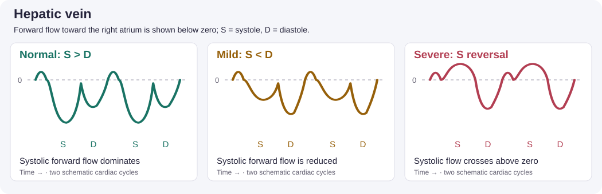
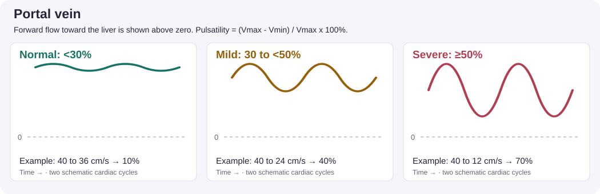
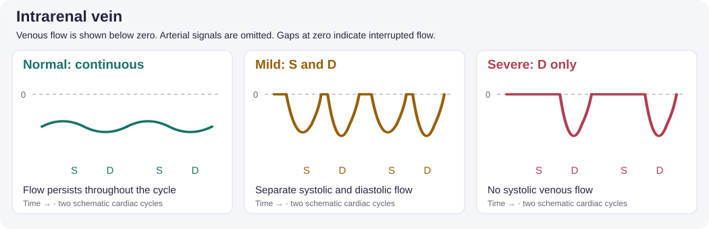

## 1. Clinical question

::: {.callout-note}
**The bedside decision frame**

1. Does the patient have ongoing hypoperfusion?
2. Would increasing preload improve stroke volume?
3. Is venous congestion increasing the risk of additional fluid?

Answer these separately before choosing an intervention.
:::

IVC ultrasound contributes to right atrial pressure assessment; VExUS assesses systemic venous congestion. Neither measures circulating blood volume or establishes fluid responsiveness. Use dynamic testing, cardiac and lung ultrasound, and serial perfusion assessment together. The [2025 ESICM shock guidance](https://www.esicm.org/wp-content/uploads/2025/10/Visual-abstract-final.pdf) favors dynamic predictors over static preload markers.

**Learning objectives:** Acquire the IVC and three venous Doppler signals, distinguish normal from abnormal waveforms, assign a VExUS grade, and explain how the findings affect a fluid decision.

## 2. Image acquisition

### IVC: identify before measuring

::: {.callout-tip}

:::

Use a subcostal long-axis view and trace the vessel into the RA. Confirm that the structure is the IVC rather than the aorta. Avoid an oblique diameter and follow the vessel through respiration rather than mistaking translation for collapse.

For RA pressure estimation, measure at end-expiration, approximately 0.5–3 cm from the RA ostium, and assess inspiratory collapse. For VExUS, record the **maximum diameter during respiration**. Keep the measurement site consistent on repeat examinations. These are different assessment conventions; the VExUS threshold is **2.0 cm**, whereas the RA pressure algorithm uses **2.1 cm**. See [ASE guidance](https://www.asecho.org/wp-content/uploads/2025/03/PIIS0894731725000379.pdf) and the [original VExUS study](https://doi.org/10.1186/s13089-020-00163-w).

### Complete the four-vessel examination

Use a curvilinear or phased array probe, color Doppler, and pulsed-wave Doppler with the patient supine when tolerated.

| Vessel | Acquisition target |
|---|---|
| Hepatic | Identify a hepatic vein joining the IVC; sample within the vein before the junction. |
| Portal | Use a right lateral liver window; identify the portal vein and sample its lumen. |
| Intrarenal | Find renal interlobar vessels; optimize low-flow color and PW settings and isolate the venous signal. |

Use ECG timing when available to distinguish systole from diastole. Color and spectral display direction depend on probe orientation and settings; interpret anatomy and timing rather than color alone.

**Guided practice:** Open the [POCUS 101 VExUS tutorial](https://www.pocus101.com/vexus-ultrasound-score-fluid-overload-and-venous-congestion-assessment/) and work through its hepatic, portal, and intrarenal acquisition videos and waveform examples alongside this module.

## 3. Normal & normal variants

### IVC and estimated RA pressure

In spontaneously breathing adults:

| IVC diameter and sniff response | Estimated RA pressure |
|---|---|
| ≤2.1 cm and ≥50% collapse | 3 mmHg (range 0–5) |
| >2.1 cm and <50% collapse | 15 mmHg (range 10–20) |
| Discordant findings | 8 mmHg (range 5–10); integrate additional signs |

Athletes can have a large IVC without pathologic pressure elevation. Positive-pressure ventilation limits this algorithm's reliability. Diameter alone does not define an intermediate pressure. [ASE, 2025](https://www.asecho.org/wp-content/uploads/2025/03/PIIS0894731725000379.pdf).

### Venous waveform reference

| Doppler | Normal | Mild abnormality | Severe abnormality |
|---|---|---|---|
| Hepatic | Forward S > D | Forward S < D | Systolic reversal |
| Portal | Pulsatility <30% | 30 to <50% | ≥50% |
| Intrarenal | Continuous | Interrupted S and D phases | Interrupted, diastolic-only flow |

**Portal pulsatility fraction (%) = (Vmax − Vmin) / Vmax × 100.**

S = systole; D = diastole. In the hepatic vein, forward flow is toward the RA. In the portal vein, forward flow is toward the liver. A renal waveform described only as “monophasic” is ambiguous: distinguish continuous flow from interrupted diastolic-only flow. [POCUS 101](https://www.pocus101.com/vexus-ultrasound-score-fluid-overload-and-venous-congestion-assessment/).

### Illustrated waveform comparison

::: {.callout-tip}

**How to read these illustrations:** Dashed lines mark zero velocity; time runs left to right. These original teaching schematics show two cycles and are not patient recordings or calibrated spectral traces. Display polarity can be inverted on the ultrasound machine. Column labels describe individual waveform abnormalities, not the final VExUS grade. Compare with the [POCUS 101 examples](https://www.pocus101.com/vexus-ultrasound-score-fluid-overload-and-venous-congestion-assessment/).
:::

## 4. Pathology library

### Small, collapsible IVC

::: {.callout-tip}

:::

This appearance can accompany low right-sided filling pressure. It does not answer whether another bolus will increase cardiac output. Strong inspiratory effort can exaggerate collapse.

### Plethoric IVC

::: {.callout-tip}

:::

Consider RV dysfunction, pulmonary hypertension, tricuspid regurgitation, tamponade, and ventilator effects in addition to fluid accumulation. Review the [RV module](03-rv.qmd) and [pericardium module](04-pericardium.qmd) when those findings are present.

### Assigning VExUS C grade

| Maximum IVC diameter | Number of severely abnormal venous Doppler patterns | Grade |
|---|---|---|
| <2.0 cm | Not required by the algorithm | 0 |
| ≥2.0 cm | None | 1 — mild |
| ≥2.0 cm | One | 2 — moderate |
| ≥2.0 cm | Two or three | 3 — severe |

Count severe patterns across the hepatic, portal, and intrarenal veins; do not add waveform scores. Grade 0 does not exclude all congestion or establish a need for fluid. The original single-center study involved 145 cardiac-surgery patients; its association with AKI does not prove that treating a score improves outcomes. [Beaubien-Souligny et al., 2020](https://doi.org/10.1186/s13089-020-00163-w).

::: {.callout-caution}
**Interpretation limits**

Tricuspid regurgitation can alter hepatic flow; portal abnormalities may be confounded by liver disease. Intrarenal signals may be technically inadequate. Record missing or uninterpretable vessels explicitly rather than assigning a normal pattern. Two severe patterns with an enlarged IVC already establish grade 3; fewer observed abnormalities with missing vessels may leave the final grade uncertain.
:::

### From findings to a decision

Use a passive leg raise with real-time stroke-volume/cardiac-output measurement when appropriate. Blood pressure alone is not an equivalent readout. IVC distensibility—(maximum − minimum) / minimum × 100—is affected by ventilator settings and patient effort; a universal 18% threshold should not drive ICU fluid decisions.

Congestion increases concern about fluid harm but does not select a drug or mandate fluid removal during unstable shock. Reassess perfusion, cardiac function, respiratory status, and response to treatment. [ESICM, 2025](https://www.esicm.org/wp-content/uploads/2025/10/Visual-abstract-final.pdf).

## 5. Integration cases

*The clips illustrate the named view. Additional measurements below are supplied teaching-case data, not findings demonstrated by an IVC clip.*

### Case 1: Septic shock — another bolus?

A 72-year-old woman with urosepsis remains hypotensive after 3 L of crystalloid and norepinephrine.

::: {.callout-tip}

:::

**Supplied findings:** IVC 1.4 cm with marked collapse, hyperdynamic LV, normal-sized RV, no effusion.

**Decision:** Do not equate this appearance with a positive fluid-responsiveness test. Assess the stroke-volume response to PLR and fluid tolerance before another bolus. Reassess promptly after any intervention. A hyperdynamic EF alone does not establish adequate output.

### Case 2: CHF, pneumonia, and rising creatinine

An 80-year-old man with EF 25% remains hypotensive after 2 L of saline and has bilateral crackles.

::: {.callout-tip}

:::

**Supplied findings:** IVC 2.6 cm; hepatic systolic reversal; portal Vmax 40 and Vmin 16 cm/s; interrupted diastolic-only intrarenal flow.

**Interpretation:** Portal pulsatility is 60%; three severe patterns give VExUS grade 3. Compare the supplied patterns with the [tutorial's waveform examples](https://www.pocus101.com/vexus-ultrasound-score-fluid-overload-and-venous-congestion-assessment/).

**Decision:** Pause empiric fluid loading and evaluate mixed shock. Congestion may contribute to AKI, but does not establish its sole cause. Select circulatory support and any decongestion plan according to perfusion and the full cardiac assessment, rather than automatically starting dobutamine.

### Case 3: Ventilated after resuscitation

A 55-year-old man received 4 L during arrest resuscitation and remains on norepinephrine.

::: {.callout-tip}

:::

**Supplied findings:** IVC 2.3 cm; distensibility 10%; preserved LV systolic function; mildly enlarged RV.

**Decision:** Review ventilation and RV loading before interpreting variation. The 10% value alone cannot settle the fluid question. Obtain a suitable dynamic assessment if further fluid is being considered; evaluate venous Doppler when congestion is suspected.

### Case 4: Fever, shock, and depressed LV function

A 68-year-old man presents with fever, altered mental status, and BP 76/44.

::: {.callout-tip}

:::

**Supplied findings:** Markedly depressed LV function, IVC 2.4 cm, mild RV dilation, no effusion.

**Decision:** Evaluate a cardiac contribution alongside infection. These findings do not exclude distributive shock or identify the cause of myocardial dysfunction. Obtain comprehensive hemodynamic assessment and investigate ischemia or other causes while treating the presenting illness.

## Quiz

*For each case, explain your interpretation, choose a next step, and name a finding that would change your plan. Use the waveform reference as needed; focus on reasoning rather than memorizing cutoffs.*

::: {.callout-note}
**Q1.** A woman with pneumonia remains hypotensive after initial resuscitation. She is breathing rapidly, her IVC is small and collapses markedly, and her LV appears hyperdynamic. Your intern says, “She is clearly dry; give another liter.” What can you infer from these images, what remains unknown, and how would you decide whether more fluid will help?

::: {.callout-caution collapse="true"}
**Answer**
The images are compatible with low right-sided filling pressure, but vigorous inspiration can exaggerate IVC collapse. A hyperdynamic EF does not establish adequate cardiac output. The missing information is whether additional preload improves stroke volume and whether the patient can tolerate fluid.

If feasible, perform PLR with a real-time stroke-volume or cardiac-output measurement and assess lung findings and perfusion. A reproducible increase supports responsiveness; absent improvement or worsening respiratory congestion argues against further empiric fluid. Explain how you would reassess after any intervention rather than treating the IVC appearance as the endpoint.
:::

**Q2.** A patient with heart failure and infection has persistent hypotension, rising creatinine, a dilated IVC, markedly pulsatile portal flow, and interrupted intrarenal venous flow. A colleague proposes fluid “to improve renal perfusion.” Explain how congestion could contribute to the kidney injury. What else must you assess before choosing between further fluid, circulatory support, and decongestion?

::: {.callout-caution collapse="true"}
**Answer**
Renal perfusion depends on the pressure gradient across the kidney. Elevated venous pressure can reduce that gradient even when the circulation contains substantial fluid. The findings support a congestive contribution, but AKI can also reflect low forward flow, sepsis, obstruction, or other injury.

Assess perfusion, LV/RV function, respiratory status, and the trajectory after prior treatment. Pause reflexive fluid loading while clarifying the hemodynamics. Neither rising creatinine nor an abnormal VExUS examination selects a treatment on its own; worsening hypoperfusion would make an unqualified “diurese now” answer inadequate as well.
:::

**Q3.** During a technically adequate PLR, a patient's measured stroke volume rises reproducibly. However, the patient also has increasing oxygen requirements, diffuse B-lines, and severe venous Doppler abnormalities. The team concludes, “The test is positive, so we should give fluid.” Do you agree? Explain the distinction that matters and how you would make the decision.

::: {.callout-caution collapse="true"}
**Answer**
A positive PLR demonstrates preload responsiveness; it does not establish that fluid is necessary or that its benefits exceed its risks. This patient may increase stroke volume with fluid while also developing worse pulmonary or systemic congestion.

Establish whether ongoing hypoperfusion requires an increase in flow, then weigh that potential benefit against the respiratory and venous findings. Consider the underlying shock mechanism and alternatives to fluid. A defensible answer acknowledges both responsiveness and poor tolerance and specifies what response or deterioration would prompt reassessment.
:::

**Q4.** A patient with severe tricuspid regurgitation is being treated for congestion. Over the next day, breathing and edema improve, portal pulsatility decreases, and intrarenal flow becomes more continuous. Hepatic systolic reversal persists. A resident wants to intensify fluid removal until every waveform is normal. How would you interpret the discordant findings and respond?

::: {.callout-caution collapse="true"}
**Answer**
Severe TR can sustain hepatic systolic reversal despite improvement in congestion. The other Doppler changes and the clinical trajectory support improvement; the persistent hepatic finding alone does not establish treatment failure.

Use serial findings across vessels together with perfusion, renal function, and symptoms to judge the remaining need for decongestion. Do not pursue normalization of a valve-related waveform as an isolated treatment target. This limitation is illustrated in the [POCUS Journal case discussion](https://pocusjournal.com/article/19348/).
:::

**Q5.** A hypotensive patient has an enlarged IVC. Hepatic and portal signals look only mildly abnormal, but you cannot obtain interpretable renal Doppler. The handoff says, “VExUS is mild, so further fluid is safe.” Identify the two reasoning errors. How would you communicate your findings and decide what to do next?

::: {.callout-caution collapse="true"}
**Answer**
First, an unreadable vessel is missing information, not a normal result; a severe renal pattern could change the grade. Second, even a complete low-grade examination would not demonstrate responsiveness or guarantee fluid tolerance.

Report the observed patterns and the technical limitation explicitly. Seek a better renal signal or experienced review when useful, while using the patient's perfusion, cardiac/lung findings, and a suitable dynamic assessment to guide the immediate decision. Uncertainty should be visible in the handoff rather than hidden behind a reassuring score.
:::

**Q6.** Shortly after intubation and an increase in PEEP, a patient's IVC becomes larger and shows little respiratory variation. Blood pressure falls. A colleague interprets this as new fluid overload and recommends diuresis. Why is the timing important, and what would you reassess before acting?

::: {.callout-caution collapse="true"}
**Answer**
Positive-pressure ventilation changes intrathoracic pressure, venous return, and RV loading. An abrupt IVC change after a ventilator adjustment need not represent newly accumulated fluid. Reduced respiratory variation also cannot be interpreted using the spontaneous-breathing RA pressure algorithm.

Urgently reassess the patient, ventilator settings, RV/LV function, lung findings, and other causes of post-intubation hypotension. Compare the examination with the pre-intubation findings. The decision should address the mechanism of deterioration rather than treating a larger IVC as an automatic indication for fluid removal.
:::
:::

## References & further reading

<a class="lecture-card" href="https://www.pocus101.com/vexus-ultrasound-score-fluid-overload-and-venous-congestion-assessment/" target="_blank" rel="noopener">&#9654;VExUS: acquisition videos and waveform examplesVi Dinh · POCUS 101 · External tutorial</a>

- Dinh V. [VExUS Ultrasound Score — Fluid Overload and Venous Congestion Assessment](https://www.pocus101.com/vexus-ultrasound-score-fluid-overload-and-venous-congestion-assessment/). Primary learning resource for this module; accessed September 4, 2026.
- Beaubien-Souligny W, et al. [Quantifying systemic congestion with Point-Of-Care ultrasound: development of the venous excess ultrasound grading system](https://doi.org/10.1186/s13089-020-00163-w). *The Ultrasound Journal*. 2020;12:16. Use the VExUS C algorithm; grade 3 requires at least two severe patterns.
- Mukherjee M, et al. [ASE Guidelines for the Echocardiographic Assessment of the Right Heart in Adults and Special Considerations in Pulmonary Hypertension](https://www.asecho.org/wp-content/uploads/2025/03/PIIS0894731725000379.pdf). 2025.
- Monnet X, et al. [ESICM guidelines on circulatory shock and hemodynamic monitoring](https://doi.org/10.1007/s00134-025-08137-z). 2025.
