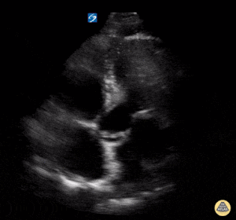

## 1. Clinical question

*What clinical question does this exam answer, and how do findings change management?*

::: {.callout-note}
**The bedside decision frame:** One question with two branches.

**Is there significant valvular pathology contributing to this patient's hemodynamic or respiratory presentation?**

- **Stenosis** obstructs forward flow — it limits cardiac output and causes pressure overload upstream.
- **Regurgitation** creates a volume leak — it wastes stroke volume and volume-overloads the chamber receiving the regurgitant jet.

The bedside exam does not replace formal echocardiography for grading severity. It answers whether a valve problem is present, whether it is likely to be severe, and whether it changes immediate management.
:::

Valvular pathology is identified at the bedside with 2D assessment of valve morphology and motion, and with color Doppler to detect regurgitant jets. Quantitative Doppler gradients (CW Doppler, pressure half-time) require training beyond the scope of basic critical care echo, but the qualitative findings — dense calcification, restricted opening, a large regurgitant jet — are accessible to any provider who can obtain the standard windows.

---

## 2. Image acquisition

*Probe, windows, and technique for this module.*

Use a **phased array (cardiac) probe** on the **cardiac preset**. Color Doppler requires setting a color box over the valve of interest; keep the box small to maintain frame rate. Align the Doppler beam as parallel as possible to the direction of blood flow — jets aimed away from the beam will be underestimated.

---

### Parasternal long axis — aortic and mitral valves

::: {.callout-tip}
**Video slot:** PLAX with color Doppler across the aortic and mitral valves — normal vs pathologic jets.
:::

**What you are looking for:**
- **Aortic valve:** Three thin leaflets opening widely in systole. Restricted opening, thickening, or calcification suggests stenosis. Color Doppler in systole: no flow acceleration (no aliasing/turbulence) in a normal valve.
- **Mitral valve:** Anterior leaflet swings widely open in diastole (the "fish mouth" opens). Restricted diastolic opening suggests stenosis. Color Doppler in systole: any jet directed back into the LA suggests regurgitation.

---

### Parasternal short axis — aortic valve

::: {.callout-tip}
**Video slot:** PSAX at the aortic valve level — the "Mercedes-Benz" sign of a normal tricuspid valve, the reduced orifice area of severe AS, bicuspid valve appearance.
:::

**What you are looking for:** Three equal leaflets forming a Y-shaped (Mercedes-Benz) configuration on closure. Bicuspid aortic valve: two leaflets, fish-mouth opening, often with a raphe. Dense calcification and reduced orifice area indicate severe stenosis.

---

### Apical four-chamber — mitral and tricuspid valves

::: {.callout-tip}
**Video slot:** A4C with color Doppler — mitral regurgitation jet into the LA, tricuspid regurgitation jet into the RA.
:::

**What you are looking for:**
- MR jet: color Doppler in systole, jet directed from LV into LA. A jet occupying >50% of the LA area suggests severe MR (qualitative).
- TR jet: color Doppler in systole, jet from RV into RA. Large TR jets allow RVSP estimation (4v² + RAP, where v is the peak TR velocity by CW Doppler).

---

### Apical five-chamber or apical long axis — aortic valve

::: {.callout-tip}
**Video slot:** Apical 5-chamber or APLAX with color Doppler across the aortic valve — turbulent systolic jet in AS, diastolic regurgitant jet in AR.

:::

**What you are looking for:**
- AS: color aliasing (turbulent flow) in systole directed from LV through the LVOT and aortic valve into the aorta.
- AR: diastolic jet directed from the aortic valve back into the LVOT. Width of the jet relative to the LVOT width correlates with severity.

---

## 3. Normal & normal variants

::: {.callout-tip}
**Video slots:** Normal aortic, mitral, and tricuspid valves — 2D morphology and color Doppler. Normal trace MR and TR as variants.
:::

### Normal aortic valve

Three thin, pliable leaflets that open fully (touching the aortic walls) in systole and coapt centrally in diastole. No color aliasing in systole. No diastolic regurgitant jet. Leaflet thickening without calcification or restriction — aortic sclerosis — is common in older adults and does not cause obstruction.

### Normal mitral valve

Anterior and posterior leaflets with wide diastolic excursion. The anterior leaflet is larger and dominates the image on PLAX. Normal coaptation in systole with no gap between leaflets. A trace MR jet on color Doppler is a normal variant (present in up to 70% of normal subjects) — it is central, brief, and small.

### Normal tricuspid valve

Three leaflets visible on subcostal and apical views. Trace TR is a normal variant and is used to estimate RVSP — a normal RVSP is less than 35 mmHg. Mild TR without RV dilation is not pathologic.

### Physiologic regurgitation

Trace MR, trace TR, and trace pulmonary regurgitation are all common normal variants detectable by sensitive color Doppler. They are identified by their small jet area, brief duration, and absence of structural valve abnormality or downstream chamber dilation.

---

## 4. Pathology library

*Organized by valve and finding.*

### Aortic stenosis

::: {.callout-tip}
**Video slots:**
- Calcific AS — dense leaflet calcification, reduced opening on PLAX and PSAX
- Color Doppler turbulent jet in systole
- Severely reduced aortic valve opening area on PSAX
:::

Calcific aortic stenosis is the most common valvular disease in adults over 65. The leaflets are thickened, echogenic, and immobile. The orifice area on PSAX is visually reduced.

**Bedside qualitative severity markers:**

| Finding | Suggests Severe AS |
|---|---|
| Dense calcification of all leaflets | Yes |
| Reduced or absent leaflet excursion | Yes |
| Visually small orifice on PSAX | Yes |
| Hyperdynamic LV compensating | Chronic, compensated |
| Reduced LV function | Decompensated, late |

**Teaching points:**

- Critical AS in a hypotensive patient is a cardiac surgery emergency — urgent AVR or TAVR is the only definitive treatment.
- Avoid vasodilators in severe AS — they drop afterload without increasing cardiac output (the valve is the fixed obstruction) and can cause precipitous hypotension.
- Intra-aortic balloon pump can temporize hemodynamics as a bridge.
- Low-flow, low-gradient AS (severe stenosis with reduced EF) can be missed on Doppler — the gradient is low because the ventricle cannot generate adequate flow. 2D morphology is critical.

---

### Aortic regurgitation

::: {.callout-tip}
**Video slots:**
- Acute AR — diastolic jet, hyperdynamic LV, premature mitral valve closure
- Chronic AR — dilated LV with a large AR jet, preserved function
:::

AR causes diastolic backflow from the aorta into the LV. Acute AR (endocarditis, aortic dissection, trauma) is a hemodynamic emergency — the unprepared LV cannot accommodate the sudden volume load.

**Key bedside features:**

- Diastolic color Doppler jet from aortic valve into LVOT (apical 5-chamber or APLAX view)
- **Acute AR:** Hyperdynamic LV (not yet dilated), premature mitral valve closure on M-mode (diastolic pressure rises rapidly, closes the mitral valve before atrial contraction — a sign of severely elevated LVEDP)
- **Chronic AR:** Dilated, volume-overloaded LV with preserved or reduced EF depending on stage

**Teaching points:**

- Acute AR from aortic dissection or endocarditis is a surgical emergency. Do not delay for hemodynamic stabilization — call CT surgery.
- Premature mitral valve closure is a critical finding that indicates the LVEDP has exceeded LA pressure — the LV is in crisis.
- Vasodilators (nitroprusside) can reduce regurgitant fraction acutely in non-operative candidates; IABP is contraindicated (increases diastolic aortic pressure, worsening regurgitation).

---

### Mitral regurgitation

::: {.callout-tip}
**Video slots:**
- Acute MR from flail leaflet — eccentric, wall-hugging jet, hyperdynamic LV
- Chronic MR — large central jet, dilated LA, dilated LV
- Ischemic MR — inferior wall motion abnormality with posteriorly directed jet
:::

MR causes systolic backflow from the LV into the LA. Acute MR (papillary muscle rupture, chordal rupture, endocarditis) is poorly tolerated — the LA has not had time to dilate and pressures rise acutely.

**Key bedside features:**

- Systolic color jet from LV into LA on A4C or PLAX
- **Acute MR:** Eccentric, wall-hugging jet (Coanda effect — may be underestimated by color Doppler), hyperdynamic LV, non-dilated LA, pulmonary edema out of proportion to LV function
- **Chronic MR:** Large central or posteriorly directed jet, dilated LA, dilated LV
- **Ischemic MR:** Regional wall motion abnormality (usually inferior/posterior), posteriorly directed jet from malcoaptation

**Teaching points:**

- Acute MR from papillary muscle rupture complicating inferior MI is a surgical emergency. The echo finding of a flail posterior leaflet with an inferior RWMA should trigger immediate cardiac surgery consultation.
- Eccentric jets in acute MR are frequently underestimated by color Doppler — the jet wraps along the LA wall and appears smaller than it is.
- Do not mistake a small eccentric jet for mild MR without examining the LA size and the hemodynamic picture.

---

### Mitral stenosis

::: {.callout-tip}
**Video slots:**
- Rheumatic MS — hockey stick anterior leaflet deformity, reduced diastolic separation, commissural fusion
- Color Doppler: diastolic turbulence through the mitral valve
:::

MS causes obstruction to diastolic LV filling. Almost always rheumatic in etiology. The anterior mitral leaflet takes on a "hockey stick" or "elbow" deformity — the body of the leaflet bows toward the septum while the restricted tip remains tethered.

**Key bedside features:**

- Restricted mitral valve diastolic opening on PLAX (normal excursion >2.5 cm)
- Hockey stick deformity of the anterior leaflet
- Commissural fusion on PSAX — the leaflets appear fused at the commissures, with a reduced orifice area
- Color Doppler: high-velocity diastolic jet through the MV into the LV
- LA dilation (chronic pressure overload)

**Teaching points:**

- MS in a patient with new atrial fibrillation and hemodynamic compromise is an emergency — tachycardia eliminates diastolic filling time and can precipitate flash pulmonary edema. Rate control (not cardioversion as first-line) is the priority.
- Balloon mitral valvuloplasty is the intervention of choice for favorable anatomy. Bedside echo helps triage urgency.
- In pregnant patients, MS is the valvular lesion most likely to cause acute decompensation.

---

### Tricuspid regurgitation and RVSP estimation

::: {.callout-tip}
**Video slots:**
- TR jet on color Doppler — A4C view
- CW Doppler through TR jet — peak velocity for RVSP calculation
:::

TR is most often functional (secondary to RV dilation) rather than primary leaflet disease. RVSP estimation from the peak TR velocity is one of the most useful quantitative measurements available at the bedside.

**RVSP = 4 × (peak TR velocity)² + estimated RAP**

Estimated RAP from IVC (see Module 5): 5 mmHg (small, collapsible), 10 mmHg (intermediate), 15–20 mmHg (large, non-collapsing).

**Teaching points:**

- RVSP >35 mmHg = pulmonary hypertension. RVSP >60 mmHg = severe pulmonary hypertension.
- Accurate measurement requires CW Doppler aligned parallel to the TR jet — off-axis measurements underestimate velocity.
- Severe TR can reduce the gradient (low peak velocity) even with severe RV failure, because the RA pressure rises to meet the RV pressure.
- Flail tricuspid leaflet from pacemaker lead injury, endocarditis, or trauma — large eccentric TR jet, RV dilation, systemic venous congestion.

---

## 5. Integration cases

*Cases where the finding changes management.*

---

### Case 1: Hypotensive patient with critical aortic stenosis

**Clinical scenario:** A 78-year-old woman with known "moderate" aortic stenosis is admitted with a syncopal episode and is now hypotensive (BP 82/54). She is pale, with a grade 3/6 systolic murmur at the right upper sternal border radiating to the carotids.

**What exam would you perform?**
Focused cardiac ultrasound — aortic valve, LV function.

::: {.callout-tip}
**Video slot:** Loops for interpretation.
:::

**What you see:**
Dense aortic valve calcification. Reduced leaflet excursion. Visually small orifice on PSAX. LV mildly reduced EF (40%). Hyperdynamic response absent.

**How does this change management?**
Critical AS with decompensated LV — this is low-flow, low-gradient severe AS. Avoid vasodilators and aggressive diuretics (she needs preload). Urgent cardiology and CT surgery consultation for TAVR or surgical AVR. The decision about the approach will be made at the valve center, not in the ED — transfer urgently. IABP may be considered as a bridge in refractory hemodynamic compromise.

---

### Case 2: Acute pulmonary edema after inferior MI

**Clinical scenario:** A 63-year-old man is 48 hours post-inferior STEMI (now revascularized). He develops acute onset severe dyspnea with O2 saturation 82%. A new loud holosystolic murmur is heard at the apex.

**What exam would you perform?**
Focused cardiac ultrasound — mitral valve, LV function.

::: {.callout-tip}
**Video slot:** Loops for interpretation.
:::

**What you see:**
Inferior and posterior wall motion abnormality (known from prior). Posterior mitral leaflet flail segment. Large eccentric MR jet directed anteriorly along the interatrial septum. LA not dilated. Hyperdynamic LV.

**How does this change management?**
Acute severe MR from posterior papillary muscle rupture — a mechanical complication of inferior MI. This is a surgical emergency. The non-dilated LA with acute, massive MR means LA pressure is rising rapidly — the patient is heading toward cardiogenic shock. Call CT surgery immediately. Nitroprusside to reduce afterload as a bridge. IABP to augment forward flow. Do not delay for catheterization — go to the OR.

---

### Case 3: Right heart failure with elevated RVSP

**Clinical scenario:** A 55-year-old woman with systemic sclerosis presents with progressive exertional dyspnea and lower extremity edema. JVD is present. She has a soft systolic murmur at the left lower sternal border.

**What exam would you perform?**
Focused cardiac ultrasound with TR jet interrogation.

::: {.callout-tip}
**Video slot:** Loops for interpretation.
:::

**What you see:**
Dilated RA and RV. TR jet on color Doppler. CW Doppler peak TR velocity 4.2 m/s. IVC 2.3 cm, non-collapsing (estimated RAP 15 mmHg). RVSP = 4(4.2)² + 15 = 71 + 15 = 86 mmHg.

**How does this change management?**
Severe pulmonary hypertension (RVSP 86 mmHg). In a patient with systemic sclerosis, pulmonary arterial hypertension is a known complication and a major cause of mortality. Refer urgently to a pulmonary hypertension center. Right heart catheterization is required to confirm diagnosis and guide therapy. Begin PAH-targeted therapy (phosphodiesterase inhibitor or endothelin receptor antagonist) in consultation with a specialist.

::: {.callout-tip}
**Case format reminder:** The case ends with a management decision, not just a diagnosis.
:::

---

## Quiz

Anki deck for spaced repetition: *link coming soon.*

::: {.callout-note}
**Q1.** On PLAX, you see the anterior mitral leaflet taking on a curved "hockey stick" shape in diastole. What is the diagnosis and what is the hemodynamic consequence?

::: {.callout-caution collapse="true"}
**Answer**
Mitral stenosis. The hockey stick deformity results from rheumatic commissural fusion — the leaflet body is pliable but the tip is tethered. The hemodynamic consequence is obstruction to diastolic LV filling, causing elevated LA pressure, LA dilation, pulmonary hypertension, and reduced cardiac output. Atrial fibrillation and tachycardia are particularly poorly tolerated because they reduce diastolic filling time.
:::

**Q2.** How do you estimate RVSP from tricuspid regurgitation, and what are the limitations?

::: {.callout-caution collapse="true"}
**Answer**
RVSP = 4 × (peak TR velocity in m/s)² + estimated RAP. RAP is estimated from IVC size and collapsibility. Limitations: requires a well-aligned CW Doppler beam parallel to the TR jet (off-axis measurements underestimate velocity); in severe TR with elevated RA pressure, the RV-RA gradient may be low (low TR velocity) despite severe RV failure; requires a measurable TR jet (not all patients have one).
:::

**Q3.** A patient with acute aortic regurgitation has premature mitral valve closure on M-mode. What does this finding mean physiologically?

::: {.callout-caution collapse="true"}
**Answer**
Premature mitral valve closure means the diastolic LV pressure has risen above LA pressure before atrial contraction — the LV is so volume-loaded that it closes the mitral valve early. This indicates critically elevated LVEDP, impending hemodynamic collapse, and the urgent need for surgical intervention. It is one of the most ominous signs in acute AR.
:::

**Q4.** Why is color Doppler alone unreliable for grading the severity of an eccentric MR jet?

::: {.callout-caution collapse="true"}
**Answer**
Eccentric jets (Coanda effect) hug the atrial wall, constrained by the wall's boundary layer, and appear smaller than they are on color Doppler. A wall-hugging jet may be severe despite a small apparent color area. Other clues to severe MR — pulmonary edema out of proportion to LV function, hyperdynamic LV, non-dilated LA in acute presentation, or a clearly visible flail segment — should raise suspicion even when the jet appears small.
:::

**Q5.** Why are vasodilators dangerous in severe aortic stenosis?

::: {.callout-caution collapse="true"}
**Answer**
In severe AS, the aortic valve is the fixed obstruction to outflow. Cardiac output cannot increase in proportion to the drop in systemic vascular resistance caused by vasodilators. The result is a precipitous drop in blood pressure without a compensatory increase in cardiac output. Vasodilators should be avoided or used with extreme caution in severe AS; the definitive treatment is relieving the obstruction.
:::
:::
