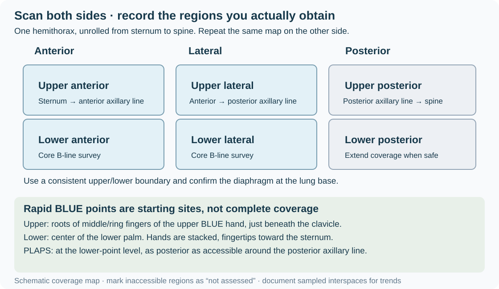

## 1. Clinical question

Lung ultrasound helps assess pleural apposition, fluid, loss of aeration, and peripheral consolidation in dyspnea, hypoxemia, and shock. Interpret each finding alongside the clinical trajectory and other bedside data.

::: {.callout-note}
**Four questions to guide the examination**

1. **Could pneumothorax explain deterioration?** Sliding, a true B-line, or lung pulse excludes pneumothorax at the examined location. Absent sliding is nonspecific; an absent lung point does not exclude pneumothorax. Treat clinically suspected tension physiology without waiting for a confirmatory sign.
2. **Is there pleural fluid?** Establish its location and relationship to the diaphragm, then assess symptoms and cause. Appearance alone does not select drainage.
3. **What is the B-line burden and distribution?** Bilateral B-lines may accompany cardiogenic or inflammatory edema, fibrosis, and other interstitial processes. A count does not establish etiology.
4. **Is there peripheral consolidation?** Consider pneumonia, atelectasis, contusion, and other causes. A negative or incomplete scan cannot exclude pneumonia.
:::

The BLUE framework organizes findings in acute respiratory failure. It supports a working diagnosis; it does not replace evaluation of competing or coexisting causes. Cardiac ultrasound, ECG, laboratory testing, and other imaging may change the interpretation.

## 2. Image acquisition

### Probe, position, and settings

- A high-frequency linear probe gives detailed pleural imaging. A curvilinear or phased-array probe provides depth for B-lines, fluid, and consolidation. Choose adequate penetration for the patient and target.
- Start supine or semirecumbent as tolerated. Examine posterior regions by sitting, turning, or carefully accessing the posterolateral chest when safe. Record regions that cannot be obtained.
- Use a lung preset if available, but inspect its settings. For artifact assessment, turn off tissue harmonics and spatial compounding when they suppress or alter artifacts; place the focus near the pleura and set depth to show artifacts extending into the far field. Adjust gain to preserve visible pleura, artifacts, and tissue interfaces. Use comparable probe/settings for serial counts. [International LUS consensus](https://onlinelibrary.wiley.com/doi/10.1002/jum.16088), [primary settings study](https://pmc.ncbi.nlm.nih.gov/articles/PMC8518047/).

### Identify the pleura before interpreting artifacts

Begin longitudinally, indicator toward the head, with two adjacent ribs and their shadows framing an interspace. The pleural interface is normally deeper than the rib surfaces—often about 0.5 cm deeper in adults—not a fixed distance below the skin. Chest-wall thickness varies. Superficial fascia is not the pleural line. [Anatomical landmark](https://pubmed.ncbi.nlm.nih.gov/24401163/).

At the bases, identify the diaphragm and liver or spleen before labeling fluid or tissue as thoracic. Sweep through accessible interspaces, observe several respiratory cycles, and distinguish local artifact/bronchogram motion from movement of the whole image.

### Rapid BLUE points and an expanded survey

For each hemithorax, the original BLUE landmarks use two hands scaled to the patient's size: place the upper hand with its little finger just beneath the clavicle and fingertips at the sternum; place the second hand directly below, excluding thumbs. The **upper BLUE point** is near the roots of the middle/ring fingers of the upper hand; the **lower BLUE point** is at the center of the lower palm. The **PLAPS point** lies at the same horizontal level as the lower point, as posterior as accessible around the posterior axillary line in the supine patient. Confirm the diaphragm rather than assuming a fixed basal depth. [Original BLUE-point description](https://d-nb.info/1199925225/34).

Rapid points do not cover the entire lung. Expand to anterior, lateral, and posterior regions on both sides when looking for focal disease, heterogeneous injury, or the extent of an abnormality. Consolidation can occur outside dependent regions.

{fig-align="center" width="900"}

For the **eight-zone anterolateral B-line survey used here**, examine upper and lower anterior and lateral regions on each side: anterior lies between sternum and anterior axillary line; lateral lies between anterior and posterior axillary lines. Use a consistent horizontal boundary, such as the fourth interspace, between upper and lower regions, and confirm the diaphragm at the inferior boundary. Record the exact sampled interspace in each zone and use it again for trends. Sweep the rest of the zone for focal abnormalities; report them separately rather than adding counts from multiple interspaces as though they came from one window. Add upper/lower posterior regions when accessible for a broader examination.

**Document:** indication; patient position; oxygen/ventilator support; probe and relevant settings; zones and sampled interspaces; sliding/pulse, A-lines/B-lines, pleural appearance, consolidation and bronchogram motion, fluid; inaccessible regions; working interpretation and next action. Save representative loops. An inaccessible zone is **not assessed**, not normal.

## 3. Normal findings and limits

::: {.callout-tip}

:::

**Lung sliding:** respiratory motion at the pleural interface. M-mode may show the seashore pattern. Sliding establishes pleural apposition at that location.

**A-lines:** horizontal reverberations separated by the skin-to-pleura distance. With sliding, they indicate aerated lung beneath the sampled pleura. They do not establish that the entire lung is normal or exclude PE, focal pneumonia, or every presentation of edema.

**Lung pulse:** pleural motion transmitted from the heart, sometimes evident when ventilation is absent. A true lung pulse supports pleural apposition at that location; its absence is not independently diagnostic.

## 4. Pathology library

### B-lines and interstitial patterns

::: {.callout-tip}

:::

B-lines arise from the pleural interface, extend to the far field without fading, and obscure intersected A-lines. They move with pleural sliding when sliding is present; absent sliding does not prevent a B-line pattern.

**Counting in the specified survey:** Record discrete B-lines in the selected interspace of each zone; mark confluent artifacts as confluent rather than inventing an exact count. At least three B-lines defines a positive sampled zone for this approach. A typical diffuse bilateral congestion pattern has at least two positive zones on each side. A few dependent artifacts can occur in healthy lungs; confluent artifacts indicate marked loss of aeration, not a specific cause. [EACVI consensus](https://academic.oup.com/ehjcimaging/article/24/12/1569/7224431).

::: {.table-responsive tabindex="0" role="region" aria-label="Comparison table"}

| Pattern | Interpretation to investigate |
|---|---|
| Bilateral, relatively homogeneous, smoother pleura | Supports cardiogenic congestion in the appropriate clinical setting |
| Patchy bilateral distribution, spared areas, irregular pleura/consolidation | Raises concern for inflammatory injury; mixed causes remain possible |
| Focal B-lines beside an abnormal pleural surface | Consider local pneumonia, contusion, or another peripheral lesion |
| Chronic basal artifacts with irregular pleura | Consider fibrosis and compare prior studies |

:::

Reduced EF does not establish the cause of B-lines; cardiogenic edema can also occur with preserved EF. Treatment depends on congestion, blood pressure, respiratory status, and likely cause. Infection can coexist. Serial reduction supports improvement in congestion when acquisition is comparable, but does not prove a single etiology. Document changes in position and ventilator settings that may affect the comparison.

### Pleural effusion

::: {.callout-tip}

:::

Identify fluid above the diaphragm between the chest wall and lung. It may be anechoic, echogenic, septated, or loculated. A quad-shaped fluid window and sinusoidal motion of adjacent lung can support identification; these signs need not appear in every effusion. Adjacent compressed lung may look tissue-like.

**Appearance is not chemistry:** Anechoic fluid can be an exudate or infected; complex fluid may reflect infection, malignancy, blood, or chronic inflammation. Consolidation beside fluid may be compressive atelectasis rather than pneumonia.

**Size and volume:** Document extent, accessible depth, loculation, and adjacent anatomy. Numeric estimation is optional. The Balik model estimates **volume (mL) ≈ 20 × maximal interpleural separation (mm)**, equivalent to **200 × separation (cm)**. It was developed in selected mechanically ventilated patients, supine with mild torso elevation, using a transverse basal measurement at end expiration. Thus 50 mm corresponds to about 1,000 mL under that model. Do not apply this conversion to an arbitrary pocket, a loculated collection, or a different acquisition. It does not identify a safe insertion site. [Balik et al.](https://pubmed.ncbi.nlm.nih.gov/16432674/).

**From fluid to treatment:** Separate diagnostic sampling from therapeutic drainage. For suspected pleural infection, combine clinical course, accessible volume, pus/microbiology, and pleural-fluid chemistry. Pus or appropriately sampled pH ≤7.2 generally supports drainage when safely accessible; intermediate results require additional assessment, with septation contributing to the decision. Complexity alone does not mandate a chest tube. [BTS pleural disease guideline](https://www.brit-thoracic.org.uk/document-library/guidelines/pleural-disease/pleural-disease-full-supplement/).

Before any pleural procedure, confirm indication and a safe ultrasound window with the patient in the procedure position, identify diaphragm/abdominal organs throughout respiration, and follow the supervised local procedure pathway. Recheck after any repositioning.

### Pneumothorax

Air separating the pleural layers eliminates sliding at the affected site. **Absent sliding**, with or without an M-mode barcode pattern, is nonspecific: apnea, mainstem intubation, adhesions/pleurodesis, and severe lung disease can produce it.

A **true lung point** is a reproducible transition between a pneumothorax pattern and apposed lung during respiration. It strongly supports pneumothorax when correctly identified, but no accessible point may be found with a large pneumothorax. Its position alone does not determine drainage. Sliding, true B-lines, or lung pulse excludes pneumothorax only where that sign is seen. [Original lung-point study](https://www.ultrasoundleadershipacademy.com/wp-content/uploads/2014/01/Intensive_Care_Med_2000_Lichtenstein.pdf).

In a deteriorating patient with suspected tension physiology, arrange immediate decompression according to the emergency pathway; do not wait for a lung point, CXR, or CT. After intubation, rapidly assess tube depth/position, capnography, patency, equipment, and bilateral ventilation while considering pneumothorax. Reposition a tube when indicated by the assessment, not by an automatic fixed-distance rule. [WSES-AAST guidance](https://link.springer.com/article/10.1186/s13017-025-00651-1).

### Consolidation and bronchograms

::: {.callout-tip}

:::

Consolidation becomes visible when loss of aeration reaches an accessible pleural surface. Lung appears tissue-like, sometimes with bright air bronchograms or branching fluid-filled airways. Deep lesions surrounded by aerated lung may be invisible.

- **Dynamic air bronchograms:** branching air moves within the consolidation relative to its surrounding tissue during respiration. This supports pneumonia over resorptive atelectasis; it is not simply movement of the whole consolidated lobe.
- **Static air bronchograms:** leave both pneumonia and atelectasis possible. They do not prove airway obstruction or exclude infection. In the original study, 20 of 52 pneumonias had static bronchograms. [Primary bronchogram study](https://pubmed.ncbi.nlm.nih.gov/19225063/).

Assess secretions, tube position, lobar volume loss, infection evidence, and the clinical trajectory. Use airway clearance or bronchoscopy for a supported obstruction/diagnostic indication. Assess and treat suspected pneumonia on clinical grounds; do not wait for dynamic bronchograms. Routine bronchoscopic BAL is not required for every suspected VAP. A negative scan does not exclude pneumonia. [ATS/IDSA HAP/VAP guidance](https://www.idsociety.org/practice-guideline/hap_vap/), [prospective pneumonia study](https://pubmed.ncbi.nlm.nih.gov/22700780/).

## 5. The BLUE framework

Apply the profile definitions together; **B-lines and absent sliding must not enter conflicting branches**. The following profiles suggest diagnoses within the BLUE approach, which should then be checked against the patient. [Author's BLUE/FALLS account](https://journal.chestnet.org/article/S0012-3692%2815%2937223-8/fulltext).

::: {.table-responsive tabindex="0" role="region" aria-label="Comparison table"}

| Anterior profile | Definition | Next assessment / suggested diagnosis |
|---|---|---|
| A | Bilateral predominant A-lines with sliding | Assess for DVT; if negative, assess PLAPS |
| B | Bilateral predominant B-lines **with sliding** | Supports pulmonary edema |
| B′ | Bilateral B-lines **without sliding** | Pneumonia/inflammatory disease pattern; integrate other causes |
| A/B | A-lines on one side, predominant B-lines on the other | Pneumonia pattern |
| C | Anterior consolidation | Pneumonia pattern, with other consolidation causes considered |
| A′ | Predominant A-lines without sliding | Look for lung pulse, B-lines elsewhere, and a lung point when stable; pneumothorax remains possible without a point |

:::

For an **A-profile**, DVT increases suspicion for PE. If DVT is not found, PLAPS supports pneumonia in the original pathway; absent PLAPS favors COPD/asthma after clinical assessment. **Negative DVT does not exclude PE**, and absent PLAPS does not exclude all pneumonia. Continue definitive evaluation when suspicion persists.

The original selected acute-respiratory-failure cohort reported 90.5% overall diagnostic accuracy; uncertain, mixed, and rare diagnoses were excluded. B-profile sensitivity for edema was 97%, and A-profile plus DVT sensitivity for PE was 81%—these are **sensitivities, not positive predictive values**. Do not translate them into fixed patient probabilities. Mechanical ventilation and complex ICU/mixed disease require particular caution. [Original BLUE study](https://pubmed.ncbi.nlm.nih.gov/18403664/).

Combine with [LV assessment](02-lv.qmd), [RV assessment](03-rv.qmd), [IVC/congestion assessment](05-ivc.qmd), and the [shock integration module](06-integration.qmd) when appropriate.

## 6. Integration cases

*Clips illustrate a finding at one site. Bilateral distribution, other-organ findings, and clinical details below are supplied case data, not all demonstrated by a single clip.*

### Case 1: Hypertensive pulmonary edema with an open infection assessment

**Scenario:** A 72-year-old man with HTN and known HFrEF develops acute dyspnea, saturation 82% on room air, diaphoresis, and BP 198/110. CXR has bilateral opacities.

**Exam:** Bilateral anterolateral and accessible posterior lung survey, plus focused cardiac ultrasound.

::: {.callout-tip}

:::

**Supplied findings:** Homogeneous bilateral B-lines with sliding, small bilateral effusions, known low EF, and no consolidation in the regions obtained.

**Decision:** Hypertensive cardiogenic pulmonary edema is the leading working diagnosis. Support oxygenation, use NIV when appropriate, and treat blood pressure/congestion with appropriately selected vasodilator and diuretic therapy. Assess infection from history, examination, laboratory/imaging data, and trajectory; absence of visible consolidation is not a reason by itself to withhold antibiotics. Repeat a comparable survey after treatment. Improvement supports decongestion but does not exclude concurrent pneumonia.

### Case 2: Sudden deterioration after intubation

**Scenario:** A 45-year-old man desaturates from 94% to 78% after intubation, with absent left breath sounds.

**Exam:** Immediate airway/equipment assessment and bilateral anterior lung ultrasound during resuscitation.

::: {.callout-tip}

:::

**Supplied findings:** Right sliding and A-lines; left absent sliding, barcode pattern, and no B-lines.

**Decision:** Consider right mainstem intubation, obstruction/equipment failure, and left pneumothorax. Verify capnography, tube depth/position and patency, and bilateral ventilation; correct an identified tube problem and reassess promptly. Lung pulse on the left would support apposition there. If shock or severe deterioration suggests tension pneumothorax, decompress without waiting for a lung point or radiograph. If stable enough, further ultrasound and imaging can clarify the diagnosis. Failure to find a point does not remove pneumothorax from the differential.

### Case 3: Traumatic pneumothorax—what determines drainage?

**Scenario:** A hemodynamically stable 30-year-old man after a motorcycle collision has right chest contusions. FAST shows no abdominal free fluid or pericardial effusion.

**Exam:** Extend to bilateral lung assessment as eFAST.

::: {.callout-tip}

:::

**Supplied findings:** Left sliding; right absent anterior sliding and a lung point at the midaxillary line.

**Decision:** The findings support right pneumothorax. The lung-point position alone does not establish a size category or mandate a tube. Assess respiratory impairment, support/anticipated positive-pressure ventilation, extent on appropriate imaging, progression, associated injury, and ability to monitor. Involve the trauma team to select drainage or closely monitored observation under its pathway. Selected small stable pneumothoraces may be observed; do not assume this case qualifies without the missing information. Deterioration with tension physiology requires immediate decompression. [Trauma guidance](https://link.springer.com/article/10.1186/s13017-025-00651-1).

### Case 4: Fever, hypoxemia, and static bronchograms

**Scenario:** An intubated 68-year-old man, postoperative day 3 after abdominal surgery, develops fever 38.8°C and a FiO2 increase from 0.40 to 0.70.

**Exam:** Broad bilateral lung survey, including posterior regions, with airway and infection assessment.

::: {.callout-note}
**Text-based interpretation case:** Use the supplied findings below. A verified matching static-bronchogram cine is not currently embedded.
:::

**Supplied findings:** Anterior A-lines and sliding bilaterally; right posterobasal consolidation with static air bronchograms and a small adjacent effusion.

**Decision:** Pneumonia, atelectasis, and coexisting obstruction remain possible. Obtain appropriate respiratory sampling and evaluate/treat suspected hospital-acquired or ventilator-associated infection according to the clinical assessment and local pathway. Check tube position, secretion burden, and evidence of lobar volume loss; provide airway clearance and consider bronchoscopy when obstruction or another specific indication is supported. Static bronchograms alone neither select bronchoscopy nor defer antibiotics. The effusion requires its own assessment; complexity or proximity to consolidation would not alone mandate drainage.

## Quiz

::: {.callout-note}
**Q1.** A patient has chronic basal B-lines and an irregular pleural surface. Does a positive B-line zone establish acute pulmonary edema?

::: {.callout-caution collapse="true"}
**Answer**
No. Describe the count/burden in the specified sampled windows, distribution, pleural morphology, prior findings, and clinical change. A positive window is not diffuse bilateral disease, and fibrosis can produce B-lines. Use the overall congestion and cardiac assessment before selecting treatment.
:::

**Q2.** After intubation a patient develops shock, absent left sliding/B-lines, and no accessible lung point. Can pneumothorax be excluded?

::: {.callout-caution collapse="true"}
**Answer**
No. A large pneumothorax may have no accessible point. Assess the airway, equipment, and tube position promptly while resuscitating. If the clinical picture suggests tension pneumothorax, do not delay decompression for a point, a fixed-distance tube withdrawal, or a radiograph. A true lung pulse or sliding excludes pneumothorax only at the sampled site.
:::

**Q3.** Posterior zones cannot be obtained, and the anterior scan is normal. How should the result be documented?

::: {.callout-caution collapse="true"}
**Answer**
Record the sampled sites and findings and state that posterior regions were not assessed. Do not report a globally negative lung study or exclude posterior/deep pneumonia. Seek additional views or imaging if the unanswered question changes care. For serial studies, document position, respiratory support, probe/settings, and the same sampled interspaces.
:::

**Q4.** A febrile ventilated patient has consolidation with static bronchograms. Should bronchoscopy replace an infection evaluation?

::: {.callout-caution collapse="true"}
**Answer**
No. Pneumonia can have static bronchograms. Assess and treat infection when clinically indicated while investigating atelectasis or obstruction. Bronchoscopy needs a supported indication. Dynamic motion within the bronchograms relative to the surrounding tissue supports pneumonia over resorptive atelectasis, but static motion does not establish the converse.
:::

**Q5.** An A-profile is present but compression ultrasound finds no DVT. Can PE be dismissed?

::: {.callout-caution collapse="true"}
**Answer**
No. A negative DVT examination does not exclude PE. Continue evaluation according to probability and stability; PLAPS findings and other tests may identify competing causes. Sliding excludes pneumothorax locally, and an A-profile does not categorically exclude edema. The original BLUE 81% value for A-profile plus DVT was sensitivity, not a fixed PPV.
:::

**Q6.** A stable patient has a septated effusion of uncertain cause. Is that enough to prescribe a chest tube, and can any 5-cm fluid pocket be called 1 L?

::: {.callout-caution collapse="true"}
**Answer**
Neither conclusion follows. Integrate symptoms, cause, diagnostic sampling/chemistry when indicated, and safe access before selecting drainage. A complex appearance is nonspecific. The Balik estimate uses 20 × separation in millimeters under its defined acquisition and population; 50 mm gives about 1,000 mL only within that model. Arbitrary or loculated pocket depth is not a reliable volume or safe-site measurement.
:::
:::

## References and further reading

- [International LUS consensus, 2023](https://onlinelibrary.wiley.com/doi/10.1002/jum.16088): acquisition and interpretation standards.
- [Lichtenstein and Mezière, original BLUE study](https://pubmed.ncbi.nlm.nih.gov/18403664/) and [BLUE-point landmarks](https://d-nb.info/1199925225/34).
- [EACVI consensus, 2023](https://academic.oup.com/ehjcimaging/article/24/12/1569/7224431): B-lines and congestion.
- [Lung-point study](https://www.ultrasoundleadershipacademy.com/wp-content/uploads/2014/01/Intensive_Care_Med_2000_Lichtenstein.pdf): diagnostic value and sensitivity limitations.
- [Balik et al., 2006](https://pubmed.ncbi.nlm.nih.gov/16432674/): method-specific effusion-volume estimation.
- [Reissig et al., 2012](https://pubmed.ncbi.nlm.nih.gov/22700780/) and [Lichtenstein et al., 2009](https://pubmed.ncbi.nlm.nih.gov/19225063/): pneumonia detection and bronchograms.
- [BTS pleural disease guideline, 2023](https://www.brit-thoracic.org.uk/document-library/guidelines/pleural-disease/pleural-disease-full-supplement/): sampling and drainage decisions.
- [ATS/IDSA HAP/VAP guidance](https://www.idsociety.org/practice-guideline/hap_vap/): infection assessment and sampling.
- [WSES-AAST thoracic trauma guidance, 2025](https://link.springer.com/article/10.1186/s13017-025-00651-1): pneumothorax assessment and treatment.

---

## Video lectures

Full-length teaching lectures from the University of Utah's [Echocardiography & Perioperative Ultrasound](https://echo.anesthesia.med.utah.edu/tee/focus-content/) FoCUS program. Each opens on the Utah ECHO site in a new tab.

<a class="lecture-card" href="https://echo.anesthesia.med.utah.edu/lung-ultrasound-101-introduction-pneumothorax/" target="_blank" rel="noopener">&#9654;Lung Ultrasound 101 — Introduction &amp; PneumothoraxUniversity of Utah · Echo &amp; Periop Ultrasound</a>
<a class="lecture-card" href="https://echo.anesthesia.med.utah.edu/point-care-lung-ultrasound-part-2-water-effusion-edema/" target="_blank" rel="noopener">&#9654;Point-of-Care Lung Ultrasound Part 2 — Fluid (Effusion &amp; Edema)University of Utah · Echo &amp; Periop Ultrasound</a>

